# Våra favoritrecept på svenska  
{: .no_toc }  
  

  
  
  
    Innehåll  
  
  
  {: .text-delta }  
- TOC  
{:toc}  

  
  
  
# Baka  
  
## 1, 2, 3-kakor. Saftig sockerkaka. Naemis kaka (Dagmars receptsamling)  
  
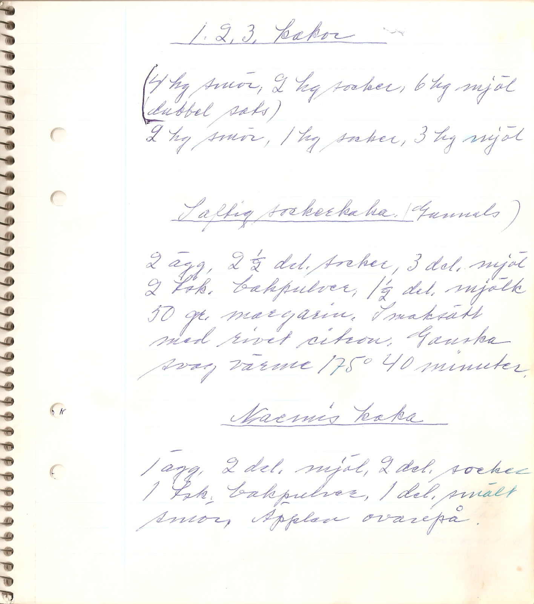  
  
### 1, 2, 3-kakor  
  
- 4 hg smör, 2 hg socker, 6 hg mjöl (dubbel sats)  
- 2 hg smör, 1 hg socker, 3 hg mjöl  
  
### Saftig sockerkaka (Gunnels)  
  
2 ägg, 2½ dl socker, 3 dl mjöl, 2 tsk bakpulver, 1½ dl mjölk, 50 g margarin.  
  
Smaksätt med rivet citron. Ganska svag värme, 175 grader, 40 minuter  
  
### Naemis kaka  
  
1 ägg, 2 dl mjöl, 2 dl socker, 1 tsk bakpulver, 1 dl smält smör. Äpplen ovanpå.  
  
  
## Agnetas skållade bröd  
  
3 längder. Tillagningstid 2 dagar. Ugnstemperatur 200ºC  
  
    
Skållning:  
- 5 dl kokande vatten  
- 1–2 msk kryddor  
- 2½ dl vetemjöl  
- 6½ dl grovt rågmjöl  
  
    
  
Utbakning:  
- 25 g jäst  
- 1 dl ljummet vatten  
- 3 dl surdeg  
- ½ dl sirap  
- 1 dl grovt rågmjöl  
- 3–6 dl vetemjöl  
  
1. Häll kokande vatten över de övriga ingredienserna. Arbeta ihop till en deg som får stå över natten.  
2. Blanda ned jäst utrörd i vatten, surdeg, sirap, rågmjöl samt vetemjölet litet i sänder.  
3. Låt jäsa en timme.  
4. Dela degen i tre delar. Forma runda bullar som får jäsa c:a 45 minuter.  
5. Grädda c:a 45 minuter.  
  
## Bakpulverskorpor  
  
C:a 100 st. Tillagningstid 2 timmar. Ugnstemperatur 250ºC  
  
  
- 7 dl vetemjöl  
- 3 tsk bakpulver  
- 1 dl socker  
- 2 tsk kardemumma  
- 150 g matfett  
- 1 ägg  
- 1½ dl mjölk  
  
1. Blanda samman de torra ingredienserna.  
2. Fördela matfettet i mjölblandningen med fingertopparna.  
3. Vispa samman ägget och mjölken och blanda i det.  
4. Forma degen till små bullar och lägg dem på smord plåt.  
5. Grädda mitt i ugnen i 5–8 min.  
6. Dela de varma bullarna med gaffel och lägg dem på plåt.  
7. Rosta och torka skorporna i 175º ugnsvärme.  
  
## Carlssons knäck  
  
- 6 msk smör  
- 4 dl socker  
- 2 dl sirap  
- 2 msk kakao  
  
1. Blanda ingredienserna och koka dem relativt häftigt c:a 10 minuter. Rör helst hela tiden  
2. Häll i en väl smörad långpanna.  
3. Låt svalna och skär sedan i bitar (börja tidigt i kanterna). Ganska jobbig att skära!  
  
  
## Dagmars vanliga pepparkakor (Dagmars receptsamling)  
  
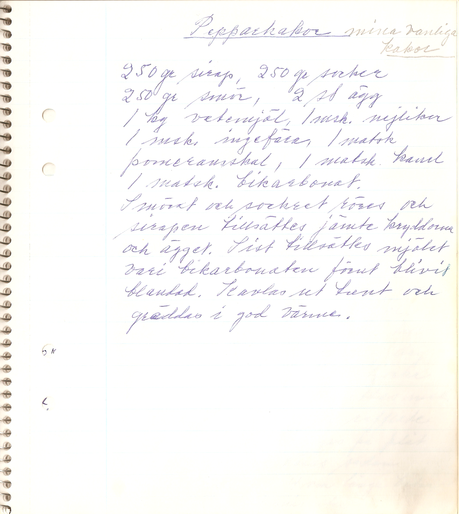  
  
250 g sirap,2 50 g socker, 250 g smör, 2 st ägg, 1 kg vetemjöl, 1 msk nejlikor, 1 msk ingefära, 1 matsked pomeransskal, 1 matsked kanel, 1 matsked bikarbonat.  
  
Smöret och sockret röres och sirapen tillsättes jämte kryddorna och ägget. Sist tillsättes mjölet vari bikarbonaten förut blivit blandad. Kavlas ut tunt och gräddas i god värme.  
  
## Engelsk fruktkaka  
  
14–16 skivor. Tillagningstid c:a 90 minuter (20 minuter). Ugnstemperatur 150ºC. Ett av Haralds favoritrecept.  
  
  
    
  
- 200 g smör eller margarin  
- 2½ dl socker  
- 4 ägg  
- 3½ dl vetemjöl  
- ½ tsk bakpulver  
- Ev. 5–10 cl konjak/sherry  
  
    
  
Smaktillsatser:  
- 2 dl russin  
- 1 dl syltat, hackat apelsinskal  
- 1 dl hackat suckat  
- 10 syltade, röda cocktailbär  
  
1. Rör matfett och socker poröst.  
2. Tillsätt äggen, ett i sänder, under fortsatt omrörning.  
3. Blanda ner smaktillsatserna i mjölet så sjunker de inte så mycket vid gräddningen.  
4. Sikta ned mjölet blandat med bakpulvret.  
5. Häll smeten i väl smord och brödbeströdd form.  
6. Lägg ett foliepapper över formen.  
7. Grädda kakan i c:a 75 minuter. Tag bort folien efter 30 minuter.  
  
  
## Evas pepparkakor  
  
?? st. Tillagningstid 2 timmar. Ugnstemperatur 175º –200ºC  
  
  
- 2 dl mörk sirap  
- 2 dl socker  
- 160 g smält smör  
- 5 dl vetemjöl  
- 1 ägg  
- kryddnejlika, ingefära och kanel (>1 tsk av varje)  
  
1. Koka sirap, socker och tillsätt kryddorna.  
2. Låt svalna litet innan smöret rörs i.  
3. Låt svalna litet till och tillsätt uppvispat ägg.  
4. Tillsätt sist mjölet.  
  
  
## Finska hålkakor  
  
4 st. Tillagningstid 2½ timme. Ugnstemperatur 225ºC  
  
  
- 1 msk smör  
- 25 g jäst  
- 5 dl vatten  
- 2 dl surdeg  
- 1 msk stött kummin  
- 1 l fint rågmjöl  
- c:a 5 dl vetemjöl  
  
1. Smält smöret och värm vätskan till 37º.  
2. Smula jästen och tillsätt krydda, surdeg, degspad och rågmjöl.  
3. Arbeta in det mesta av vetemjölet tills degen är fast och jämn.  
4. Låt jäsa c:a 50 minuter.  
5. Tag upp degen och forma fyra runda bullar som kavlas ut till 18 cm i diameter.  
6. Tag ut ett hål i mitten och nagga med gaffel.  
7. Låt jäsa på plåten i 30 minuter.  
8. Grädda mitt i ugnen i 15–20 minuter.  
  
## Fridlunds sockerkaka  
  
Tillagningstid 1 timme. Ugnstemperatur 200 ºC  
  
- 2 ägg  
- 1 kaffekopp socker  
- ½ kaffekopp vetemjöl  
- ½ kaffekopp potatismjöl  
- 1 rågad tsk bakpulver  
  
1. Vispa ägg och socker länge.  
2. Blanda vetemjöl, potatismjöl och bakpulver och rör ned i smeten.  
3. Häll i smord och bröad form och grädda i c:a ?? minuter.  
4. Låt svalna och servera inom någon dag.  
  
  
## Frilufsare  
  
C:a ?? st. Tillagningstid ½ timme  
  
    
  
- ¾ dl socker  
- 3 dl vetemjöl  
- 1 tsk bakpulver  
- 1 tsk vanillinsocker  
- 1 ägg  
- 1½ dl mjölk  
- smör eller margarin till stekning  
- strösocker till garnering  
  
1. Blanda de torra ingredienserna i en bunke.  
2. Rör ner ägg och mjölk och vispa snabbt ihop tills smeten är jämn.  
3. Kakorna kan gräddas i en stekpanna på spisen eller på stormkök om man är ute i naturen.  
4. Smält matfettet i pannan.  
5. Klicka ut smeten med två skedar och grädda ett par minuter på varje sida.  
6. Vänd de färdiggräddade kakorna i socker. Servera dem varma med sylt.  
  
## Flottyrringar  
  
- 2 äggulor  
- 1 kkp grädde  
- minst 1 kkp socker  
- 1 tsk bakpulver  
- mjöl efter behov  
- rivet apelsin- eller citronskal  
- flottyr  
  
1. Blanda samman degen tills den är möjlig att kavla.  
2. Kavla ut degen och ta ut kakor med kransmått.  
3. Fritera dem guldbruna.  
  
## Fru Möllers kringla. Bruna bröd (Ruths kakor) (Dagmars receptsamling)  
  
  
texten kompletterad av Harald L.  
### Fru Möllers kringla  
  
½ kg vetemjöl, 125 g socker, 1 tesked kardemumma, 100 g smör, 1 kopp russin, suckat, 6 teskedar bakpuler, 6 dl mjölk  
  
### Bruna bröd (Ruths kakor)  
  
2 hg smör, 1 3/4 dl socker, 1 matsked sirap, 1 matsked kanel, lite kardemumma, 1 äggula, 2 teskedar bikarbonat (hjorthornsalt), 4–5 koppar mjöl (5–6 dl)  
  
Smör och socker röres; de andra ingredienserna iblandas. Smöret smältes först och får kallna. Små runda kakor som tryckes till med en gaffel. (Kulor med 2 cm diameter. Ugn 200 grader, 10 minuter)  
  
  
## Fryst efterrättstårta »À la Ehrenmark«   
  
12 bitar. Tillagningstid 1 timme  
  
    
  
- 4 dl crème fraîche  
- 3 ägg  
- 2 dl strösocker  
- 1 tsk vaniljsocker  
- rivet skal av en citron  
- 3 dl vispgrädde  
- 6–8 digestivekex  
  
1. Krossa kexen och strö hälften av krosset på botten av en 1½-litersform med löstagbar botten.  
2. Skilj äggulor och vitor. Vispa äggvitor och grädde var för sig till skum.  
3. Blanda crème fraîche med äggulor, socker, vaniljsocker och citronskal i en stor skål.  
4. Rör försiktigt ned den vispade grädden och de vispade äggvitorna.  
5. Häll smeten i formen och strö över resten av de krossade kexen.  
6. Täck formen med plastfolie och ställ den i frysen.  
7. Efter 4–6 timmar är tårtan genomfryst och klar att servera efter ha att tinat ungefär en halvtimme i rumstemperatur.  
  
  
## GI-bröd med nötter  
  
Ugnstemperatur 175 ºC  
  
Ingredienser till en limpa:  
- 6 dl grahamsmjöl  
- 4 dadlar, färska, hackade  
- ½ dl rågkross  
- ½ dl linfrön, hela  
- ½ dl solrosfrön  
- ½ dl hackad mandel  
- ½ dl hackade valnötter  
- 1½ tsk bikarbonat  
- 1½ tsk salt  
- 6 dl filmjölk  
- 2 msk mörk sirap  
- ½ dl pumpafrön att strö ovanpå  
  
1. Smörj en avlång form. Strö på lite grahamsmjöl  
2. Hacka dadlarna och rör ihop ingredienserna, *förutom pumpafröna*, i en skål. Häll smeten i formen  
3. Strö på pumpafrön  
4. Grädda längst ner i ugnen cirka en timme  
  
## Gifflar (Dagmars receptsamling)  
  
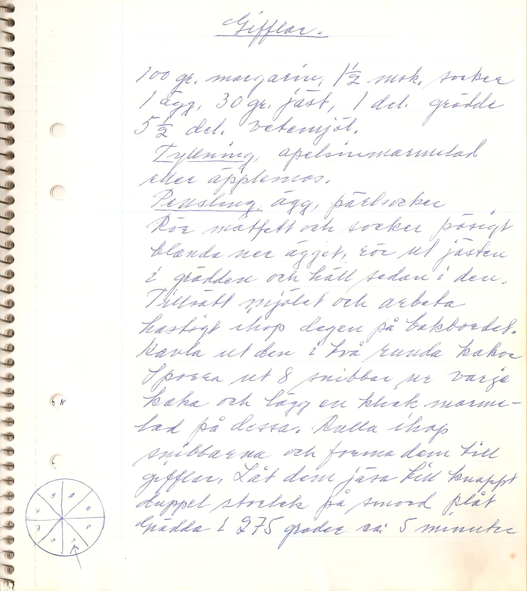  
  
100 g margarain, 1½ msk socker, 1 ägg, 30 g jäst, 1 dl grädde, 5½ dl vetemjöl  
  
_Fyllning:_ apelsinmarmelad eller äpplemos  
  
_Pensling:_ ägg, pärlsocker    
  
Rör matfett och socker pösigt. Blanda ner ägget, rör ut jästen i grädden och häll sedan i den. Tillsätt mjölet och arbeta hastighet ihop degen på bakbordet. Kavla ut den i två runda kakor. Sporra ut 8 snibbar ur varje kaka och lägg en klick marmelad på dessa. Rulla ihop snibbarna och forma dem till gifflar. Låt dem jäsa till knappt duppel storlek på smord plåt. Grädda i 275 grader c:a 5 minuter.  
  
  
## Goda bullar. Smulpaj (Dagmars receptsamling)  
  
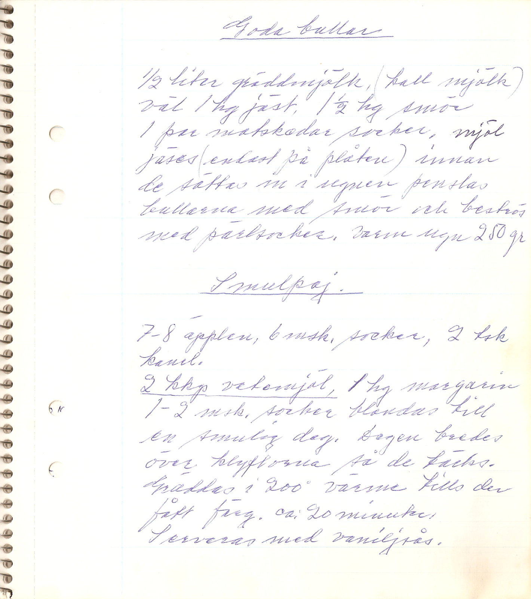  
  
### Goda bullar  
  
½ liter gräddmjölk (kall mjölk), väl 1 hg jäst, 1½ hg smör, 1 par matskedar socker, mjöl. Jäses (endast på plåten). Innan de sättas in i ugnen penslas bullarna med smör och beströs med pärlsocker. Varm ugn, 250 grader.  
  
### Smulpaj  
  
7–8 äpplen, 6 msk socker, 2 tsk kanel (blandas).  
  
2 kaffekoppar vetemjöl, 1 hg margarin, 1–2 msk socker blandas till en smulig deg. Degen bredes över klyftorna så de täcks. Gräddas i 200 graders värme tills den fått färg, c:a 20 minuter. Serveras med vaniljsås.  
  
## Goda nötkakor  
Ugnstemperatur 200–225ºC.   
  
- 2 hg smör el. margarin  
- 1 1/4 hg socker  
- 1 hg skorpsmulor  
- 1 hg malda hasselnötter  
- 2 hg vetemjöl  
  
1. Alla ingredienserna arbetas tillsammans till en smidig deg.  
2. Degen rullas till fingertjocka längder.  
3. Dessa läggs på plåt och utplattas med gaffel så att de blir refflade på längden.  
4. Gräddas i 6–8 minuter och skäres tvärs över i 3–4 cm stora bitar.  
  
  
## Goda vardagsrutor  
  
24 bitar. Tillagningstid 1 timme. Ugnstemperatur 200ºC (Ur Mat-Land n:r 13, 1985)  
  
    
  
- 3 dl havregryn  
- 2 dl rågflingor  
- 1 dl grahamsgryn  
- 50 g smör el. margarin  
- 5+2 dl vatten  
- 50 g jäst  
- 2 msk sirap  
- 1 krm salt  
- c:a 12 dl lantvetemjöl  
  
1. Mät upp havregryn, rågflingor, grahamsgryn och matfett i en bunke.  
2. Slå över 5 dl kokande vatten och rör om. Låt blandningen svalna knappt ½ timme till fingervärme.  
3. Blanda i sirap, salt och jästen utrörd i 2 dl kallt vatten.  
4. Arbeta in vetemjölet till en stadig deg.  
5. Låt jäsa under bakduk i 30 minuter.  
6. Knåda degen slät i bunken. Stjälp upp degen på smord bakplåt.  
7. Mjöla degen litet och kavla sedan ut den så att den täcker plåten.  
8. Dela med bakskrapa i 24 delar. Låt brödet jäsa c:a 30 minuter.  
9. Grädda i c:a 30 minuter.  
  
## Grova ringar  
  
30 st. Tillagningstid 1 timme. Ugnstemperatur 200ºC  
  
  
  
- 1½ dl rågmjöl  
- 5 dl rågsikt  
- drygt 1 tsk hjorthornssalt  
- 100 g smör  
- ½ dl sirap  
- 2 dl gräddfil  
  
1. Blanda alla torra ingredienser.  
2. Smula i smöret med fingrarna och rör till sist ned sirap och gräddfil.  
3. Tag upp degen på bakbordet och del den i 30 bitar.  
4. Rulla ut dem till längder och forma dem till avlånga ringar.  
5. Lägg dem ganska tätt – de flyter inte ut – på smord plåt.  
6. Grädda mitt i ugnen i 10–12 minuter.  
  
## Haralds rågbröd (morfarsbröd)  
6 levar. Tillagningstid 2 dagar. Ugnstemperatur 200 ºC  
### Ingredienser  
#### Dag 1  
- 1 l filmjölk  
- 100 g jäst  
- rågmjöl  
  
#### Dag 2  
- 1 liter varmt vatten  
- ½ liter mjölk  
- c:a 3 kg rågsikt  
- ev. mer rågmjöl  
  
### Gör så här  
1. Smula jästen i stor degbunke. Tillsätt filmjölk och så mycket rågmjöl att det blir en lös deg.  
2. Täck över och låt jäsa över natten.  
3. *Dag 2:* Tillsätt vätska och det mesta av mjölet. Arbeta degen ordentligt, tag ev. upp den på bakbord och lägg tillbaka i bunken igen. Låt degen jäsa några timmar.  
4. Tag upp den på bakbordet och knåda den väl med det sista av mjölet tills den är fast och smidig.  
5. Låt den helst jäsa ytterligare en stund innan den bakas ut till rejäla levar som får jäsa till dubbel storlek, tre på varje plåt.  
6. Grädda i c:a ¾ timme.  
7. Tag ut och knacka på undersidan av brödet. Låter det ihåligt är det klart. Låt svalna på galler under bakduk.  
  
## Havrekakor med russin resp. skurna i bitar (Dagmars receptsamling)  
  
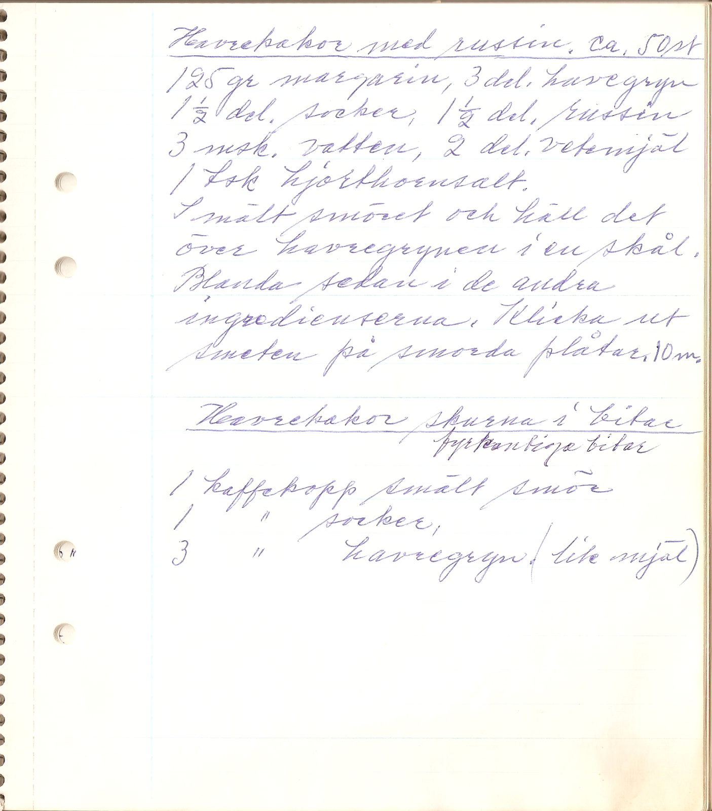  
  
### Havrekakor med russin, c:a 50 st  
  
125 g margarin, 3 dl havregryn, 1½ dl socker, 1½ dl russin, 3 msk vatten, 2 dl vetemjöl, 1 tsk hjorthornsalt.  
  
Smält smöret och häll det över havregrynen i en skål. Blanda sedan i de andra ingredienserna. Klicka ut smeten på smorda plåtar. 10 min.  
  
### Havrekakor, skurna i fyrkantiga bitar  
  
1 kaffekopp smält smör, 1 kaffekopp socker, 3 kaffekoppar havregryn, (lite mjöl)  
  
  
## Havrekex  
  
?? st. Tillagningstid 2 timmar. Ugnstemperatur 200ºC  
  
    
  
- 100 g margarin  
- ½–1 dl socker  
- 1 ägg  
- 3 msk vatten  
- 6 dl (200 g) havregryn  
- 3 dl (150 g) vetemjöl  
- 2 tsk bakpulver  
  
1. Rör margarin och socker mjukt och smidigt i en skål.  
2. Tillsätt ägget och det kalla vattnet, havregrynen och till sist mjölet blandat med bakpulvret. Tag i litet efter hand i degen, så att den blir jämn och fin.  
3. Tag upp degen på bakbordet och arbeta den tills den hänger samman.  
4. Kavla en bit i taget med brödkavel – strö bra med mjöl på bakbordet och kaveln.  
5. Tag ut käx med hjärtmått eller runt mått och lägg dem ganska tätt på smord plåt.  
6. Pricka dem med en gaffel, så bubblar de inte upp.  
7. Grädda käxen mitt i ugnen tills de är gulbruna.  
8. Lossa dem med en bred kniv och lägg dem på galler tills de svalnat.  
9. Förvara dem i burk med lock.  
  
## Havresnitt c:a 45 st, goda (Dagmars receptsamling)  
  
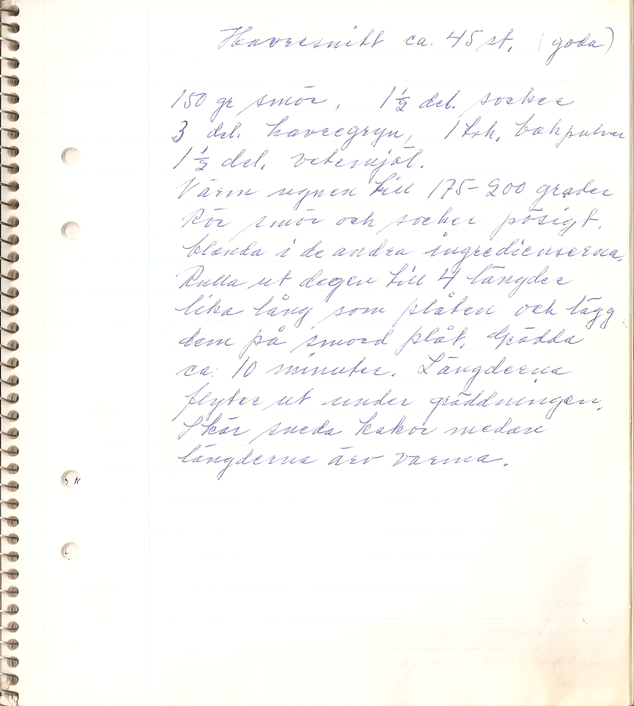  
  
150 g smör, 1½ dl socker, 3 dl havregryn, 1 tsk bakpulver, 1½ dl vetemjöl.  
  
Värm ugnen till 175–200 grader. Rör smör och socker pösigt. Blanda i de andra ingredieserna. Rulla ut degen till fyra längder lika lång som plåten och lägg dem på smord plåt. Grädda c:a 10 minuter. Längderna flyter ut under gräddningen. Skär sneda kakor medan längderna är varma.  
  
  
## Hälsobullar  
  
12 st. Tillagningstid 1 timme. Ugnstemperatur 225º–250ºC  
  
    
  
- 2 dl mjölk  
- 25 g margarin  
- 25 g jäst  
- 1 krm salt  
- 1 tsk sirap  
- 1 dl vetekli  
- ½ dl vetegroddar  
- 3–4 dl vetemjöl  
  
1. Värm mjölk och margarin till 37º.  
2. Smula jästen och blanda med degspad, sirap och salt.  
3. Rör i först i kli och groddar, sedan vetemjöl. Arbeta degen smidig.  
4. Låt degen jäsa till dubbel storlek.  
5. Knåda och baka ut till bullar och låt dem jäsa på plåt c:a 10 min.  
6. Pensla ev. bullarna med ägg och strö på vallmofrö eller vetekli.  
7. Grädda c:a 10 min.  
8. Låt kallna under bakduk.  
  
## Icas fina pepparkakor  
  
?? st. Tillagningstid 2 timmar. Ugnstemperatur 175º –200ºC  
  
    
  
- 3 dl sirap  
- 4 dl socker  
- 1½ msk ingefära  
- 1½ msk kanel  
- 1 msk nejlikor  
- 1 msk pomeransskal  
- 350 g smör  
- 3 dl vispgrädde  
- c:a 1½ kg (2½ l) vetemjöl  
- 1 msk bikarbonat  
  
1. Rör socker, sirap, kryddor och fett.  
2. Vispa grädden och blanda i.  
3. Lös bikarbonatet i vatten och blanda i det.  
4. Mjölet: spara minst ½ l.  
  
## Ingers kneipbröd  
  
2 st. Tillagningstid 3 timmar. Ugnstemperatur 250º/200ºC  
  
    
  
- 6 dl ljummet vatten  
- 25 g jäst  
- 2 dl surdeg  
- knappt 1 dl olja  
- 5 dl grovt rågmjöl  
- 8 dl grahamsmjöl  
- 5 dl vetemjöl  
  
1. Blanda samman degen och arbeta in vetemjölet efter hand tills den är smidig.  
2. Låt jäsa c:a 45 minuter.  
3. Forma två limpor, skär några snitt i dem och låt dem jäsa på plåten i 30 minuter.  
4. Sätt in dem i ugn (250º) men sänk genast värmen 200º och grädda c:a 40 minuter.  
5. Låt svalna utan bakduk.  
  
  
## Judits pepparkakor. Nötkakor (Dagmars receptsamling)  
  
  
  
### Judits pepparkakor, över 300 st  
  
3 dl grädde, 4 hg socker, 3 dl sirap, 350 g smör, 1 matsked ingefära, 1 matsked kanel, 1 matsked nejlikor, 1 matsked riven pomeransskal, 1½ kg mjöl, 2 teskedar bikarbonat. Svag ugn.  
  
### Nötkakor (goda)  
  
200 g smör, 125 g socker, 100 g skorpsmulor, 100 g malda hasselnötter, 200 g vetemjöl.  
  
Alla ingredienserna arbetas tillsammans till en smidig det som rullas till fingertjocka längder. Dessa utplattas med en gaffel så de blir refflade på längden. Läggas på plåt och gräddas. Skäras sedan tvärs över i 3–4 cm långa bitar. 200–225 grader 6–8 minuter.  
  
  
## Kajsas nyttiga godis – fröknäcke  
  
Ugnstemperatur 150ºC  
  
- 2 dl majsmjöl  
- ½ dl sesamfrö  
- ½ dl pumpakärnor  
- ½ dl solroskärnor  
- ½ dl linfrö  
- 1 tsk solja  
- ½ dl olja  
- 2 dl kokande vatten  
  
1. Blanda allt torrt.  
2. Rör i olja och kokande vatten. Låt dra några minuter.  
3. Platta ut i långpanna på bakplåtspapper tunt så att hela papperet täcks.  
4. Grädda längst ner i ugnen, cirka 50 minuter.  
  
  
## Kanelsmakande formbröd  
  
2 st. Tillagningstid 2 timmar. Ugnstemperatur 200ºC  
  
    
  
- 4 dl vatten  
- 25 g jäst  
- 100 g margarin  
- 2 dl surdeg  
- 200 g russin  
- 2 msk kanel  
- 1½ l vetemjöl  
  
1. Arbeta samman degen och låt jäsa en timme.  
2. Tag upp degen på bakbordet, forma två längder och lägg dem i smorda formar.  
3. Låt jäsa i 40 minuter.  
4. Grädda dem mitt i ugnen c:a 30 minuter.  
5. Tag ut dem ur formarna de sista minuterna så att undersidan blir bakt.  
  
## Karins rågbröd  
  
3 stora formar. Tillagningstid 2 dagar (2 timmar). Ugnstemperatur 175ºC  
  
    
Dag 1:  
- 2 dl rågkross  
- 8 dl grovt rågmjöl  
- 1 msk koriander  
- 1 l kokande vatten  
  
    
  
Dag 2:  
- 2½ dl ljummet vatten  
- 1½ paket jäst  
- 1 tsk salt  
- 1 msk ättiksprit  
- ½ dl sirap  
- 1½ dl rågsikt  
- 8 dl vetemjöl  
  
1. Det kokande vattnet hälls över mjölkblandningen, som övertäcks och får stå till nästa dag.  
2. Tillsätt alla ingredienser utom vetemjölet. Arbeta degen kraftigt.  
3. Tillsätt vetemjölet litet i sänder tills degen är fast. Låt jäsa.  
4. Häll upp degen på bakbord och knåda väl.  
5. Forma tre limpor och lägg dem i smorda formar. Låt dem jäsa.  
6. Grädda 35 minuter i form, sedan uppstjälpta på plåt i 50 minuter.  
7. Låt svalna väl insvepta i duk.  
  
## Knäck (Dagmars receptsamling)  
  
  
  
½ liter grädde, ½ liter sirap, ½ liter socker, 1 kaffekopp stötta skorpor, 1½ hg sötmandel. Grädden, sirapen och sockret hälles i denna ordning i en kastrull och får koka till smeten kännes tjock.  
  
## Kardemummakaka. Gunnels havrekakor. Alice kaffekaka (Dagmars receptsamling)  
  
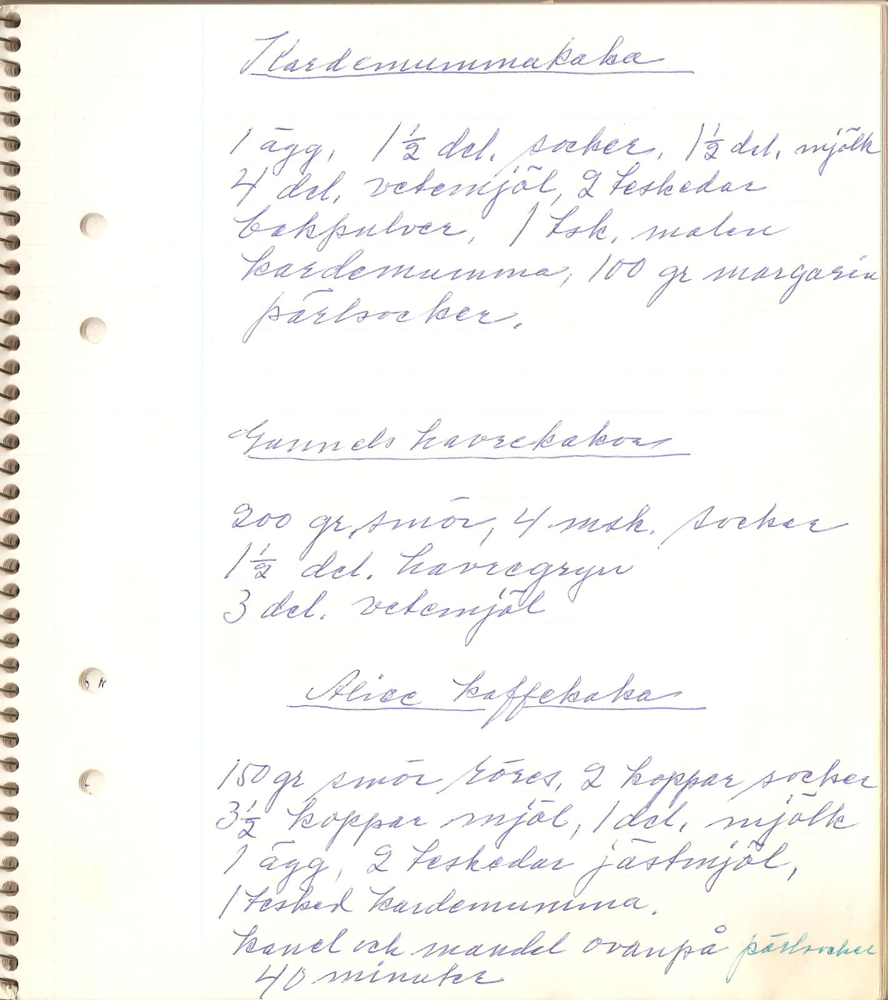  
  
### Kardemummakaka  
  
1 ägg, 1½ dl socker, 1½ dl mjölk, 4 dl vetemjöl, 2 tsk bakpulver, 1 tsk malen kardemumma, 100 g margarin, pärlsocker.  
  
### Gunnels havrekakor  
  
200 g smör, 4 msk socker, 1½ dl havregryn, 3 dl vetemjöl  
  
### Alice kaffekaka  
  
150 g smör röres, 2 koppar socker, 3½ koppar mjöl, 1 dl mjölk, 1 ägg, 2 teskedar jästmjöl (bakpulver), 1 tsk kardemumma. Kanel och mandel ovanpå pärlsocker. 40 minuter  
  
  
## Knäck. Enkel kola. Gräddkola. Praliner. Ischoklad (Konsum/Kooperativa, ur Dagmars receptsamling)  
  
  
  
  
Odaterade recept från Konsum/Kooperativa  
  
  
## Korintkakor (Agdas). Enkla kanelkransar (Dagmars receptsamling)  
  
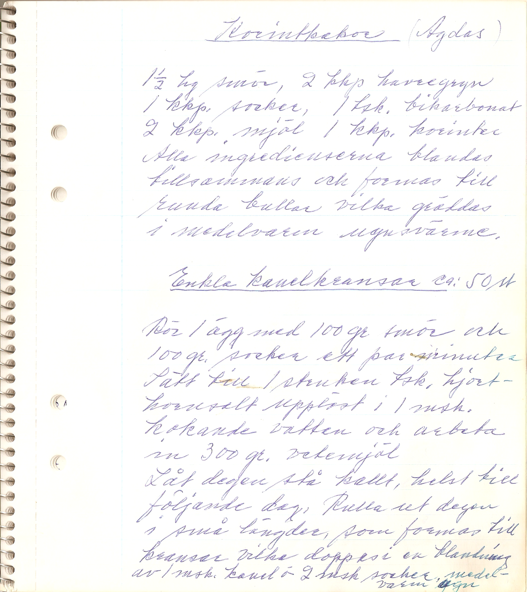  
  
### Korintkakor (Agdas)  
  
1½ hg smör, 2 kaffekoppar havregryn, 1 kkp socker, 1 tsk bikarbonat, 2 kkp mjöl, 1 kkp korinter. Alla ingredienserna blandas tillsammans och formas till runda bullar vilka gräddas i medelvarm ugnsvärme.  
  
### Enkla kanelkransar (c:a 50 st)  
  
Rör **1 ägg** med **100 g smör** och **100 g socker** ett par minuter. Sätt till **1 struken tsk hjorthornsalt** upplöst i **1 msk kokande vatten** och arbeta in **300 g vetemjöl**.  
  
Låt degen stå kallt, helst till följande dag. Rulla ut degen i små längder, som formas till kransar vilka doppas i en blandning av **1 msk kanel** och **2 msk socker**. Medelvarm ugn.  
  
## Kristinatårta  
  
12 bitar?? Tillagningstid 1½ timme. Ugnstemperatur 175ºC  
  
    
  
- 3 dl havregryn  
- 2 dl mjölk  
- 100 g margarin  
- 2 ägg  
- 2–3 bittermandlar  
- 1½ dl socker  
- 1 dl vetemjöl  
- 1 msk bakpulver  
  
1. Blanda havregryn och mjölk i en skål och låt svälla en stund.  
2. Smält matfettet och låt det svalna.  
3. Vispa ägg och socker pösigt och smaksätt med riven bittermandel.  
4. Blanda mjöl och bakpulver. Rör samman allt till en jämn smet.  
5. Häll smeten i en smord och bröad tvålitersform.  
6. Grädda kakan i c:a 30 minuter.  
  
## Kungälvspepparkaka  
  
3 längder. Tillagningstid ett par dagar. Ugnstemperatur 150ºC  
  
    
  
- ½ kg mörk sirap  
- ½ hg smör  
- 1 tsk nejlikor  
- 1 tsk ingefära  
- 2 tsk hjorthornssalt  
- 2 tsk bikarbonat  
- 2 dl gräddfil  
- 8–10 dl rågsikt  
  
1. Ljumma sirapen och matfettet. Låt det svalna.  
2. Tillsätt sedan kryddor och jäsmedel utrörda i gräddfilen.  
3. Arbeta in rågsikten. Degen, som bör vara ganska lös, arbetas väl tills den blir smidig.  
4. Strö litet mjöl över, täck med duk och ställ kallt ett par dagar.  
5. Arbeta åter degen väl. Kavla ut den på smord plåt och dela i tre delar på längden.  
6. Grädda i 25–30 minuter.  
7. Låt längderna kallna på plåten. Skär dem i bitar.  
  
## Lägerbröd  
Gräddas över öppen eld, ev. i ugn. Ugnstemperatur 200ºC (TV-program januari 1984)  
  
- 6 dl vetemjöl  
- 3 tsk bakpulver  
- 1 tsk socker  
- 2 dl mjölk (eller torrmjölk och vatten)  
- 1 tsk salt  
- 1–2 msk smör  
  
1. Blanda ingredienserna och forma till en bulle.  
2. Gräv ett hål i marken, något större än grytan, och placera grytan i hålet.  
3. Lägg i bullen och lägg på lock.  
4. Strö het aska eller glöd runt om.  
5. Grädda i c:a 30 minuter.  
  
## Majs herdinnor  
Möra, lättkavlade kakor med fin smak av kardemumma. Det går utmärkt att göra degen i matberedningsmaskin. Recept för cirka 3 bakplåtar.  
  
Ugn: 175 °C  
### Ingredienser  
- ½ ägg  
- 1½ dl socker (135 g)  
- 125 g smör  
- 3 dl vetemjöl (180 g)  
- ½ tsk hjorthornssalt  
  
Till pensling:   
- ½ ägg  
- 1 tsk stött kardemumma  
- ½ dl pärlsocker  
- ev. hackad mandel  
  
### Gör så här  
1. Vispa ägg och socker pösigt. Tillsätt smör skuret i mindre bitar. Rör ordentligt.  
2. Blanda mjöl och hjorthornssalt och arbeta in i smeten.  
3. Kavla ut degen på mjölat bakbord och ta ut kakor med mått, t.ex. runda kakor, löv eller fyrkanter.  
4. Pensla kakorna med uppvispat ägg och vänd dem i en blandning av kardemumma, pärlsocker och eventuellt hackad mandel.  
5. Lägg kakorna på smord eller bakpappersklädd plåt.  
6. Grädda i 175 graders varm ugn 5 till 6 minuter eller tills kakorna är gulbruna.  
  
  
Källa: tidningen [Land](https://www.land.se/), 1981  
  
  
## Marsipan  
Tillagningstid 1½ timme   
- 3 msk mjöl  
- 1 msk margarin  
- 1 dl grädde  
- 3 bittermandlar  
- 1½ dl sötmandel (100 g)  
- 2 dl florsocker (100 g)  
  
Idéer till garnering:  
- karamellfärg  
- mörk blockchoklad  
- kakaopulver  
- mandel  
- nötter  
- russin  
  
1. Värm mjöl, margarin och grädde i en kastrull (gärna teflon) tills det har kokat ihop till en boll.  
2. Låt bollen kallna, t.ex. genom att sätta kastrullen i vattenbad.  
3. Skålla, skala och mal mandeln.  
4. Sikta florsockret över mandeln och lägg på bollen.  
5. Knåda samman tills smeten är smidig.  
6. Tillsätt ev. mer florsocker om den är för lös.  
7. Om man färgar med karamellfärg skall den droppas outspädd över marsipanen och knådas in. Litet mer florsocker kan behövas för konsistensens skull.  
8. Forma till praliner eller figurer.  
9. Doppa ev. i smält blockchoklad eller rulla i kakao.  
10. Dekorera med mandel, nötter eller russin.  
  
## Min bästa sockerkaka. Johannisbitar (Dagmars receptsamling)  
  
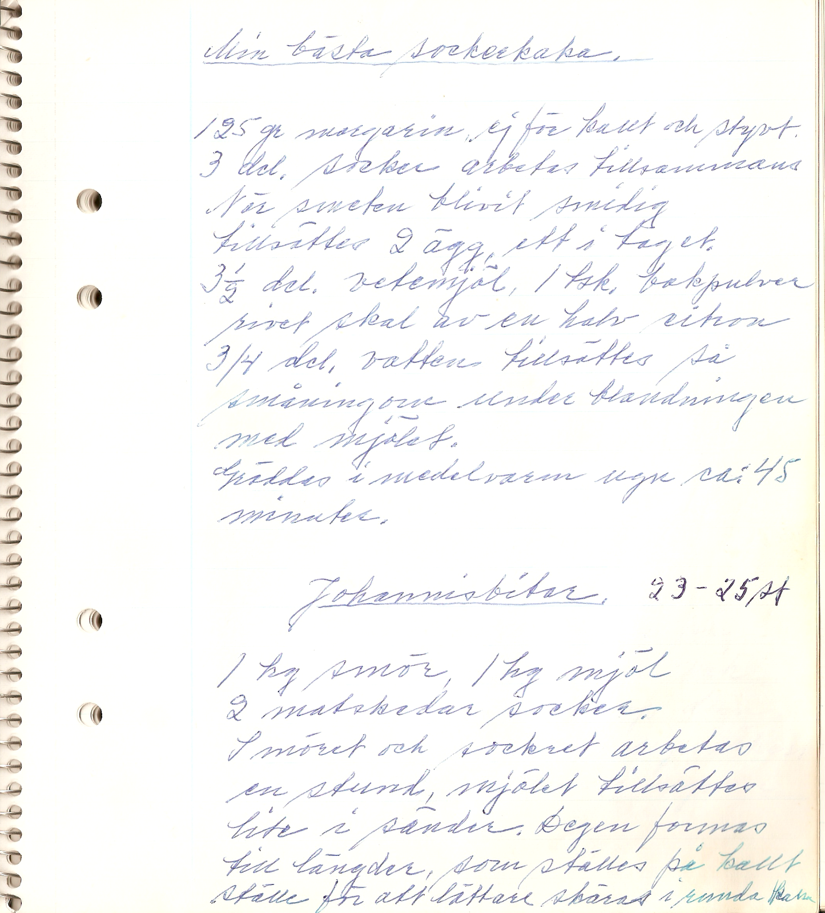  
  
### Min bästa sockerkaka  
  
**125 g margarin**, ej för kallt och styvt och **3 dl socker** arbetas tillsammans. När smeten blivit smidig tillsättes **2 ägg**, ett i taget. **3½ dl vetemjöl, 1 tsk bakpulver, rivet skal av en halv citron, 3/4 dl vatten** tillsättes så småningom under blandningen med mjölet. Gräddas i **medelvarm ugn c:a 45 minuter**.  
  
### Johannisbitar, 23–25 st  
  
1 hg smör, 1 hg mjöl, 2 matskedar socker. Smöret och sockret arbetas en stund, mjölet tillsättes lite i sänder. Degen formas till längder, som ställes på kallt ställe för att lättare skäras i runda bitar.  
  
  
## Mintkyssar  
C:a 40 st  
  
- 4 dl florsocker  
- 1 dl vatten  
- 1/4 tsk ättiksprit  
- 5–7 droppar pepparmyntolja  
- 75 g mörk blockchoklad  
  
1. Koka socker, vatten och ättiksprit tills lagen håller trådprovet: litet avsvalnad lag mellan tummen och pekfingret skall gå att dra ut till en tråd.  
2. Häll sockerlagen i en skål och tillsätt pepparmyntolja när den svalnat.  
3. Arbeta massan med en gaffel tills den blir slät, smidig och ganska fast.  
4. Placera skålen över vattenånga och rör tills massan blir seg och tjockflytande.  
5. Klicka ut den med teskedar på oljat smörpapper.  
6. Låt karamellerna stelna.  
7. Smält blockchokladen och garnera varje kyss med en klick choklad.  
  
## Mjuk sommarpepparkaka på spisen  
  
C:a ?? st. Tillagningstid 1 timme  
  
    
  
- 75 g margarin  
- 3 dl vetemjöl  
- 2 dl socker  
- 1 msk pepparkakskryddor  
- ½ tsk bikarbonat  
- 1½ dl filmjölk  
  
1. Smält matfettet och låt det svalna.  
2. Blanda mjölet med socker, kryddor och bikarbonat i en bunke.  
3. Slå över det avsvalnade fettet och filmjölken.  
4. Blanda snabbt ihop till en jämn smet och häll den i en väl smord och bröad kransform.  
5. Sätt en tyngd, t.ex. en femkrona, över hålet i mitten och täck formen omsorgsfullt med folie.  
6. Sätt formen i vattenbad som går högt upp runt kanterna utan att kakan hoppar omkring.  
7. Koka på svag värme i en timme och låt kakan svalna innan den stjälps upp.  
  
## Morotskaka  
  
Ugnstemperatur 175ºC  
  
- 2 ägg  
- 2 dl socker  
- 2 dl vetemjöl  
- 2 tsk bakpulver  
- 3 dl riven morot  
- 1 dl olja  
- 1 tsk vaniljsocker  
- 1 tsk kanel  
  
  
## Mustig prästlimpa  
  
Sex limpor. Tillagningstid 1½ timme. Ugnstemperatur 200ºC  
  
  
- 1 l vatten, 37ºC  
- 150 g jäst  
- 500 g mörkt farinsocker  
- 1 msk salt  
- 3 ägg  
- 2 kg rågsikt  
- c:a 2 dl vetemjöl, 120 g  
- ev. surdeg  
  
1. Blanda allt.  
2. Baka ut direkt till bröden, som får jäsa på två plåtar ungefär en halvtimme.  
3. Grädda på nedersta falsen i cirka en halvtimme.  
  
Källa: Karin  
  
## Möra, runda skorpor  
  
C:a 150 st. Tillagningstid 2 timmar. Ugnstemperatur 225ºC  
  
  
- 200 g matfett  
- 5 dl mjölk  
- 100 g jäst  
- 2 dl socker  
- 2 ägg  
- knappt 2 l vetemjöl  
  
1. Smält matfettet och häll i mjölken. Ljumma till 37º.  
2. Smula jästen i en degbunke, tillsätt socker och rör ut med degspadet och de uppvispade äggen.  
3. Arbeta i så mycket mjöl att degen blir fast och arbeta den sedan smidig. Låt jäsa i bunken.  
4. Tag upp degen på bakbordet. Baka ut den till bullar, platta till dem något och låt dem jäsa.  
5. Grädda mitt i ugnen.  
6. Dela dem med en gaffel mitt itu.  
7. Rosta dem guldgula i 100º–125º och låt dem torka i eftervärmen.  
  
  
## Mördeg till paj. Spritsringar (Dagmars receptsamling)  
  
  
  
### Mördeg till paj  
  
½ kg smör, 3/4 kg mjöl, 2 ägg, 4–5 matskedar socker, 4 matskedar vatten  
  
Smöret och mjölet arbetas väl tillsammans med äggen, som först slås med sockret, sedan vattnet. Degen kavlas ut till lagom tjocklek. Av denna sats blir det hälften över om man beräknar 6–7 personer.  
  
### Spritsringar  
  
140 g smör, 140 g socker, 1 äggula, 240 g mjöl. Massan går genom sprits.  
  
  
## Nyponbullar  
  
20 st. Tillagningstid 2 timmar. Ugnstemperatur 200ºC  
  
    
  
- 25 g jäst  
- 5 dl vatten  
- 1½ dl surdeg  
- 1 dl nyponsoppspulver  
- ½ msk kummin  
- 2 dl fint rågmjöl  
- 1½ l vetemjöl  
  
1. Arbeta samman degen och tag mer vetemjöl om den blir för lös.  
2. Låt jäsa c:a 50 minuter.  
3. Knåda degen på bakbordet och rulla 20 bullar. Skär ett kryss i varje.  
4. Låt bullarna jäsa 30 minuter och grädda dem 15–20 minuter.  
  
## Nötkakor. Finare vetebröd (Dagmars receptsamling)  
  
  
  
### Nötkakor (1½ sats)  
  
- 300 g smör    
- 190 g socker    
- 150 g skorpsmul    
- 150 g hasselnötter    
- 300 g vetemjöl    
  
### Finare vetebröd  
  
- 1 l kall mjölk  
- 4 hg smör smältes  
- 180 g jäst  
- 3 ägg  
- 4 dl socker  
- 2,2 dl vetemjöl  
- 2 teskedar kardemumma eller mandel eller apelsinmarmelad  
  
## Pepparmyntkarameller  
  
- 1 kg strösocker  
- 4 ½ dl vatten  
- 1 msk flytande glukos  
- 4 tsk ättiksprit  
- 20–25 droppar pepparmyntolja  
  
1. Blanda socker och vatten i en kastrull och låt blandningen stå en stund så att sockret löser sig.  
2. Rör sedan om, tillsätt glukosen och koka alltsammans i 10 minuter.  
3. Blanda i ättikspriten.  
4. Koka lagen kraftigt utan lock tills den håller brytprovet (150ºC).  
5. Häll upp smeten på en marmorskiva e.d.  
6. Droppa över pepparmyntoljan.  
7. Vik med oljad kniv upp kanterna mot mitten några gånger.  
8. Fortsätt att dra ut och vika ihop smeten med händerna. Ju mer luft som kommer in i smeten desto mer silkesskimrande blir karamellerna.  
9. Dra tills massan börjar bli trög.  
10. Forma den till smala stänger som klipps i lagom stora bitar.  
11. Förvara karamellerna i tät burk, gärna i kylskåp.  
  
## Pogácsa – små ungerska ostbollar  
En släkting till [focaccia](https://hu.wikipedia.org/wiki/Pog%C3%A1csa)! [Här är ett annat välskrivet recept på engelska](https://thebakingwizard.com/hungarian-cheese-biscuits-pogacsa/)  
  
C:a 50 st. Ugnstemperatur 200ºC  
### Ingredienser  
- ½ kg vetemjöl  
- ½ kg margarin/smör  
- 3 dl gräddfil eller crème fraîche  
- mjölk  
- 1 tsk socker  
- 25 g jäst  
- 1 tsk salt  
- 2 äggulor  
- riven ost  
  
### Gör så här  
1. Värm mjölk och gräddfil till fingervarmt. Tillsätt socker  
1. Smula i jästen, tillsätt äggulor och rör om  
1. Smula ihop mjöl och smör samt salt  
1. Tillsätt degspadet och knåda till en smidig deg  
1. Kavla ut till halvtjock platta och bestryk med margarin  
1. Vik ihop degen 3x3. Låt jäsa 5 minuter  
1. Kavla ut och vik åter ihop 3x3. Låt jäsa 5 minuter  
1. Upprepa ytterligare två gånger  
1. Kavla ut degen centimetertjock  
1. Stansa ut små runda kakor med ett litet glas  
1. Gör rutmönster med kniv och strö över riven ost  
1. Grädda i cirka 20 minuter tills de får lite färg  
  
Källa: Irene 1995-08-02  
  
  
## Pogácsa, variant med potatis  
  
Ugn 250ºC  
  
- cirka 5 dl mjöl  
- 100 g margarin  
- 1 ägg  
- 200 g potatis  
- 25 g jäst  
- ½ dl mjölk eller grädde  
- 1 tsk salt  
- 1 tsk socker  
- 1 dl riven ost  
  
1. Koka potatisen. Häll av det mesta av vattnet och mosa den, inte för slät. Låt kallna.  
2. Blanda mjukt margarin, potatisen, jäst utrörd i ljummen mjölk, salt, socker och halva ägget. Spara resten till pensling.  
3. Tillsätt mjöl och blanda väl. Degen ska vara rätt så mjuk men inte klibbig. Låt jäsa.  
4. Efter jäsning, kavla ut till fingertjocklek. Ta ut med mått. Låt jäsa på på plåten. Pensla med resten av ägget.  
5. Grädda i ugn cirka 10 minuter eller tills bullarna får vacker färg.  
  
Källa: Inga/Klara(?)  
  
## Potatisbröd  
  
2 st. Tillagningstid 2 timmar. Ugnstemperatur 200ºC  
  
    
- 3 dl vatten  
- 4 st kokta potatisar  
- 25 g jäst  
- 2 dl surdeg  
- 3 msk syltade apelsinskal  
- 6 dl grahamsmjöl  
- 6–8 dl vetemjöl  
  
1. Mosa eller pressa potatisen.  
2. Blanda samman degen med potatisen först, därefter grahamsmjölet och sist vetemjölet efter hand.  
3. Låt jäsa c:a 45 minuter.  
4. Knåda och forma två längder, lägg dem i smorda formar och låt dem jäsa 45 minuter.  
5. Grädda på nedersta falsen i c:a 30 minuter.  
  
  
## Pozsonyi kifli (Vallmolängd)  
  
Ugnstemperatur 200ºC  
  
- ½ kg vetemjöl (c:a 8 dl)  
- 2 ägg  
- 2½ hg smör/margarin  
- ½ hg socker (4 msk)  
- 25 g jäst  
- 2 dl mjölk  
- salt  
  
    
Fyllning:  
- 3 hg vallmofrö  
- 2 hg socker  
- 1,75–2 dl socker  
- 2 tsk–1 msk vaniljsocker eller citronskal  
- ströbröd  
- knappt ½ dl russin  
  
1. Blanda och värm jäst, mjölk och socker till fingervarmt.  
2. Blanda mjöl och smör och knåda till deg med vätskan.  
3. Låt jäsa.  
4. Mal vallmofröna.  
5. Koka upp mjölken och tillsätt vaniljsocker och socker.  
6. Koka upp russinen.  
7. Tillsätt vallmo och russin till mjölken.  
8. Blanda och tillsätt ströbröd om smeten blivit för lös.  
9. Kavla ut degen till fyra längder.  
10. Bred ut vallmosmeten (inte ända till kanterna).  
11. Lägg längderna på bakplåt. Ställ kallt en stund.  
12. Pensla med ägg och nagga lätt med gaffel längs underkanten.  
13. Grädda i 25–30 minuter.  
  
Källa: Irene  
  
## Pumpakaka  
  
Tillagningstid 2 timmar. Ugnstemperatur 175ºC  
  
  
- 1 kg pumpa  
- ½ l gräddmjölk  
- 5 msk vetemjöl  
- 3 ägg  
- 1–2 dl socker  
- 12 sötmandlar  
- 4 bittermandlar  
  
1. Riv pumpan grovt och låt den rinna av väl.  
2. Vispa ägg, socker, mjöl och mjölk tillsammans.  
3. Tillsätt hackad mandel och pumpa.  
4. Grädda 1–1½ timme.  
  
  
## Päron syltade med vin. Knäck. Plum-cake. Dundertårta (ur Iduns hjälpreda, Dagmars receptsamling)  
  
 Receptsida ur Iduns hjälpreda av okänt datum  
  
### Päron syltade med vin  
  
2½ kg oskalade päron, 1 kg socker, 3 dl vinättika, 3 dl vatten, 2 dl franskt vin   
  
_Beredning:_ Päronen skalas, blomfnaset borttagets, och ett kors skäres i päronet. Stjälken skrapas och afskäres till hälften. Päronen läggas efter skalningen i friskt vatten. Af sockret, ättikan och vattnet kokas en tunn lag, päronen ilägges och få koka, tills de äro klara och mjuka (omkring 3 timmar). De pröfvas genom att skära ett päron midt uti. Vinet tillsättes 15 minuter, innan päronen aflyftas från elden.     
  
### Knäck  
  
½ liter grädde, ½ liter sirap, ½ liter socker, 1 kaffekopp stötta skorpor, 1½ hg sötmandel  
  
_Beredning:_ Grädden, sirapen och sockret hällas i nu nämnda ordning i en järnkastrull, sättas öfver elden och få koka, tills smeten kännes tjock. Man profvar den genom att hälla några droppar i kallt vatten – stelnar den, så är knäcken färdig. De stötta skorporna iröras då, och knäcken får ytterligare koka 5 minuter. Sist iröres den skållade och hackade sötmandeln, och smeten slås genast upp i knäckformat.    
  
### Plum-cake  
  
- 212 g smör,    
- 212 g mjöl,    
- 212 g socker,    
- 212 g korinter,    
- 212 g russin,    
- 5 ägg,    
- succat efter smak.    
  
_Beredning:_ Smöret röres med sockret till skum. Äggulorna tillsättas en i sänder, tillika med det väl torra och siktade mjölet och därefter den rensade frukten. Till sist nedskäras de till hårdt skum slagna hvitorna. Smeten slås i smort och brödbeströdd form; ofvanpå smeten läggas några tunt skurna succatskifvor. Kakan gräddas 2–3 timmar i medelmåttig ugnsvärme.  
  
  
## Pöskaka  
  
12 bitar. Tillagningstid 1 timme. Ugnstemperatur 175ºC  
  
  
- 1 dl varmt kaffe  
- 100 g margarin  
- 2 ägg  
- 1 dl socker  
- 1 dl sirap  
- 1–1½ tsk ingefära  
- 3 dl vetemjöl  
- 2 tsk bakpulver  
  
Glasyr:  
- 2 dl florsocker  
- ½ tsk vaniljsocker  
- 4 msk vispgrädde  
  
1. Smält matfettet i det varma kaffet.  
2. Vispa ägg, socker och sirap.  
3. Blanda mjöl och bakpulver. Rör samman allt till en jämn smet.  
4. Häll smeten i en smord och bröad kransform, 1½ liter.  
5. Grädda kakan i c:a 40 minuter.  
6. Blanda glasyren slät.  
7. Stjälp upp kakan och bred över glasyren medan den är varm.  
  
  
## Sandbröd – flottyrringar – struvor (Dagmars receptsamling)  
  
  
  
### Sandbröd  
  
240 g smör, 120 g socker, 360 g mjöl arbetas tillsammans. Kavlas ut i vanlig tjocklek och tages ut med mått.  
  
### Flottyrringar  
  
2 äggulor, 1 kaffekopp grädde, väl en kaffekopp socker, 1 tesked jästmjöl, mjöl efter behov. (Jästmjöl kan bytas mot bakpulver)  
  
### Struvor  
  
3 ägg, ½ kaffekopp socker, 1 kopp vetemjöl, 1 kopp potatismjöl, 1½ kopp vatten, lite riven apelsinskal.  
  
## Solskenskaka  
  
12 bitar. Tillagningstid 1 timme. Ugnstemperatur 175º  
  
    
- 150 g smör  
- 3 ägg  
- 2½ dl socker  
- 3 dl vetemjöl  
- skållad mandel  
  
1. Smält smöret och låt det svalna.  
2. Vispa ägg och socker riktigt pösigt.  
3. Blanda i vetemjöl och smör.  
4. Häll smeten i smord och bröad 1½-litersform, helst med löstagbar kant.  
5. Grädda på första falsen i 7 minuter.  
6. Lägg på mandeln i ringar.  
7. Grädda kakan i ytterligare c:a 20 minuter.  
  
  
## Sonjas drömmar  
  
Ugnstemperatur 150ºC. Blir c:a 40 st.  
  
- 3 hg socker  
- 3 hg mjöl  
- 1 kaffekopp mjöl  
- knappt 1 kaffekopp kronolja (matolja, inte olivolja)  
- 1 tsk hjorthornssalt  
- 1 tsk vaniljsocker  
- 1 msk florsocker  
  
1. Rör ihop socker och smör.  
2. Blanda i övriga ingredienser.  
3. Forma bollar och lägg på plåt.  
4. Grädda 10–12 minuter.  
5. Öppna luckan efter halva gräddningstiden.  
  
  
## Södertäljekringlor  
  
70 st. Tillagningstid 2 timmar. Ugnstemperatur: 250ºC  
  
  
- 11 dl vetemjöl  
- 1 hg smör  
- 1¼ dl socker  
- 25 g jäst  
- 2 dl gräddmjölk  
- 3 ägg  
  
1. Finfördela matfettet i det mesta av mjölet.  
2. Tillsätt socker och jäst utrörd i den ljumma gräddmjölken.  
3. Blanda i äggen och arbeta ihop degen. Låt degen jäsa c:a 30 minuter.  
4. Arbeta den smidig med resten av mjölet.  
5. Rulla ut till blyertspennstjocka längder, c:a 30 cm långa. Forma dem till kringlor och lägg dem att jäsa.  
6. Koka upp vatten i en stor gryta.  
7. Lägg i de jästa kringlorna och låt dem koka tills de flyter upp. Tag upp dem med hålslev och lägg på smord plåt.  
8. Grädda kringlorna ljusbruna i het ugn och eftertorka i svag ugnsvärme.  
  
## Tekakor  
  
20 st. Tillagningstid 1½ timme. Ugnstemperatur 150ºC  
  
    
  
- 25 g jäst  
- 100 g margarin  
- 5 dl mjölk  
- 1 dl surdeg  
- 1 dl sirap  
- (salt)  
- 18–19 dl vetemjöl  
  
1. Blanda samman degen, som skall vara ganska lös men ej kladdig.  
2. Jäs till dubbel storlek.  
3. Dela i 20 bitar och forma dem till bullar.  
4. Låt dem vila en stund, kavla ut till tekakor och jäs c:a 40 minuter.  
5. Nagga kakorna med gaffel och grädda c:a 10 minuter.  
  
## Tysk julkaka  
  
2 st. Ugnstemperatur 190ºC (tyskt skolradioprogram 17 december 1982)  
  
    
  
Jäsdeg:  
- ½ kg vetemjöl  
- 50 g jäst  
- 1 1/4 dl mjölk  
- 100 g socker  
- 150 g smör  
- 1 ägg  
  
    
  
Tillsatser:  
- 100 g sötmandel  
- 12 g bittermandel  
- 90 g russin  
- 90 g korinter  
- 80 g suckat  
- skalet av ½ citron  
- 2 msk rom  
- litet salt  
- 2 krm kanel  
- 1 krm kardemumma  
- 1 krm malda kryddnejlikor  
  
    
  
Garnering:  
- smält smör  
- florsocker  
  
1. Skålla, skala och mal mandeln.  
2. Förbered alla tillsatser.  
3. Knåda ihop jäsdegen och tillsätt övriga ingredienser.  
4. Låt jäsa på varm plats.  
5. Lägg degen 2 st smorda avlånga formar.  
6. Grädda kakorna i c:a 80 minuter.  
7. Stjälp upp kakorna, pensla dem med smält smör och strö över florsocker.  
8. Förvara i lerkärl eller aluminiumfolie.  
  
## Tårta (Dagmars receptsamling)  
  
  
  
**3 äggulor, 1 dl socker** vispas hårt. **1½ dl smör** smältes. **5 msk mjölk, 1½ dl mjöl, 2 teskedar bakpulver** blandas ner. Smeten bredes ut på smörpapper i en långpanna. Vitorna och **2 deciliter socker** vispas hårt och bredes ovanpå den andra smeten; hackade nötter eller mandel strös på. Sättes in i ugnen i **150 grader i 30 till 40 minuter**. Dela kakan på mitten och lägg **3 deciliter vispad grädde och jordgubbar eller hallon** emellan.  
  
## Ulriks brödkakor  
  
?? st. Tillagningstid 2 dagar. Ugnstemperatur 200ºC  
  
    
  
Dag 1:  
- 1½ dl grovt rågmjöl  
- 1½ dl vatten  
- brödkrydda, t.ex. 1 tsk fänkål eller anis  
- 25 g jäst  
  
    
  
Dag 2:  
- 3½ dl vatten  
- 1 msk olja  
- ½ msk salt  
- 11 dl mjöl, gärna rågsikt och grova råg-/veteblandningar  
- (solrosfrön)  
  
1. Blanda ingredienserna enligt Dag 1.  
2. Tillsätt dag 2 övriga ingredienser och baka ut till runda kakor och platta till dem.  
3. Grädda i c:a 40 minuter.  
  
  
## Uppåkrakakor (Dagmars receptsamling)  
  
  
  
425 gram smör, 160 gram socker, 210 gram potatismjöl, 425 gram vetemjöl    
  
_Till pensling:_ 2 ägg, 50 gram sötmandel, en halv kaffekopp pärlsocker.  
  
Smöret röres med sockret och de båda mjölsorterna arbetas in. Degen kavlas ut till omkring 2 millimeters tjocklek och med ett mått tages ut runda kakor som vikas ihop nästan på på mitten. Kakorna penslas med uppvispat ägg och beströs med mandel och socker. De gräddas mycket väl i god ugnsvärme. (omkr. 90 st.)  
  
## Vaniljkakor (Dagmars receptsamling)  
  
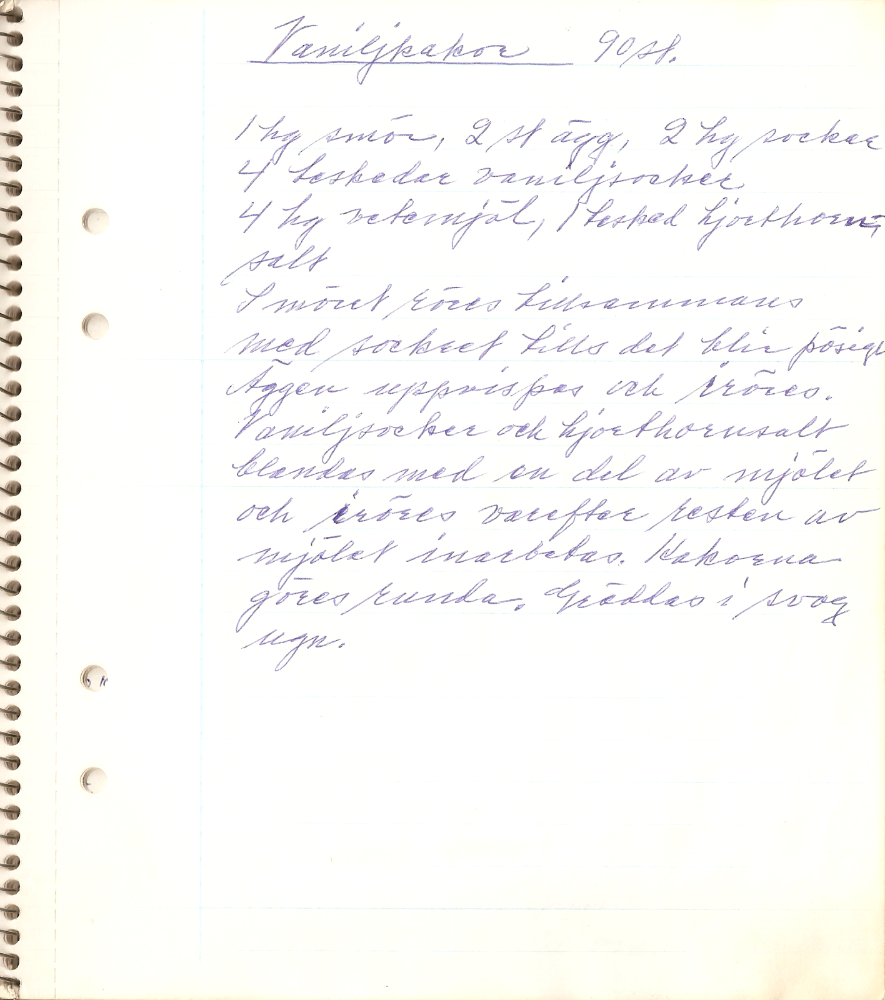  
  
1 hg smör, 2 st ägg, 2 hg socker, 4 teskedar vaniljsocker, 4 hg vetemjöl, 1 tesked hjorthornssalt  
  
Smöret röres tillsammans med sockret tills det blir pösigt. Äggen uppvispas och röres. Vaniljsocker och hjorthornssalt blandas med en del av mjölet och röres varefter resten av möjlet inarbetas. Kakorna göres runda. Gräddas i svag ugn.  
  
## Vimmerbykringlor  
  
60–70 kringlor, beroende på storlek  
  
- ½ l mjölk  
- 1 dl grädde  
- 50 g jäst  
- 200 g smör/margarin. Ta gärna hälften av varje  
- 2 ägg  
- 1 dl socker  
- vetemjöl till en inte allt för fast vetedeg  
  
    
  
1. Smält fettet och ljumma mjölken.  
2. Blanda alla ingredienser och gör en vanlig, ej för hård vetedeg.  
3. Låt degen jäsa till dubbel storlek.  
4. Arbeta degen väl och rulla ut till kringlor. Lägg dem på bakduksklädd bricka eller plåt.  
5. Låt jäsa en stund.  
6. Sätt ugnen på 250 grader.  
7. Ha en gryta med kokande vatten beredd och lägg i några kringlor i sänder. De flyter upp meddetsamma. Ta upp kringlorna mede hålslev, lägg dem på en plåt och grädda i ugn 10 till 15 minuter.  
8. Ska du baka kringlorna efter gamla traditioner ska du ha råghalm på plåten under kringlorna. Kringlorna är inte så söta och som sagt mycket hållbara.  
  
Källa: Meny, vecka 48, 2008, Ingrid Svensson  
  
## Vitt matbröd  
  
5 st. Tillagningstid 1½ timme. Ugnstemperatur 225º–250ºC  
  
    
  
- 100 g matfett  
- 1 l vassle el. mjölk+vatten  
- 75 g jäst  
- 1 msk socker  
- ½ tsk salt  
- 6 dl stenmalet vetemjöl  
- 19–20 dl vetemjöl  
- ägg  
- vallmofrön  
  
1. Smält matfettet i en kastrull. Häll på vätskan. Låt blandningen bli ljummen (37º).  
2. Smula jästen i en stor degbunke. Rör ut med degspadet.  
3. Tillsätt socker och salt. Arbeta i vetemjölet litet i taget och arbeta degen smidig och seg.  
4. Strö över mjöl, täck med bakduk och låt jäsa på dragfri plats till dubbel storlek.  
5. Häll degen på bakbordet och knåda den smidig. Dela den i fem delar och tag av en liten bit från varje del.  
6. Rulla de stora bitarna till längder och lägg på smord plåt.  
7. Rulla de små degbitarna till smala längder och sno dem dubbla. Lägg snodden på brödet och fäst ändarna väl.  
8. Låt bröden jäsa under duk till nästan dubbel storlek.  
9. Pensla med ägg och strö på vallmofrön. Grädda bröden på första falsen c:a 25 minuter.  
  
## Yoghurtbröd med kross  
  
  
2 st. Tillagningstid 1½ timme. Ugnstemperatur 200ºC  
  
    
- 2 dl vatten  
- 8 dl vete- eller rågkross  
- 5 dl yoghurt  
- 35 g jäst  
- 3 dl surdeg  
- 2 msk olja  
- 1 dl sirap  
- 10 dl grahamsmjöl  
- 8–10 dl vetemjöl  
  
1. Blöt upp krosset i 2 dl hett vatten.  
2. Lös upp jästen i rumsvarm yoghurt.  
3. Tillsätt övriga ingredienser – vetemjölet litet i sänder – till en fast deg.  
4. Låt jäsa.  
5. Knåda degen och forma till två limpor. Lägg dem på smord plåt och låt jäsa.  
6. Grädda i ?? minuter.  
  
  
  
  
___  
  
# Kallrätter  
  
  
## Ethels smörgåstårta  
C:a 12–15 bitar (Vår bostad nr 5, 1997)  
  
    
  
Fyllning 1:  
- 3 ägg  
- 1 liten purjolök  
- 1 burk tonfisk i vatten  
- 2 dl majonnäs  
  
    
Fyllning 2:  
- c:a 400 g rökt laxfilé i bit  
- 1 knippa dill  
- 3 dl vispgrädde  
- c:a 1 msk riven pepparrot  
  
    
Garnering:  
- c:a 500 g räkor  
- 1 burk (c:a 200 g) sparris  
- 1 gurka  
- 2 citroner  
- 2 dl crème fraîche  
- 2 dl majonnäs  
- 1 burk svart kaviar  
- gröna oliver med pimiento  
  
1. Gör första fyllningen: hårdkoka äggen, spola dem kalla, skala och hacka dem.  
2. Skölj och strimla purjon.  
3. Mosa tonfisken och blanda den med ägg, purjo och majonnäs.  
4. Gör nästa fyllning: skär laxköttet i småbitar, hacka dillen (men spara några kvistar till garneringt).  
5. Vispa grädden och smaksätt med c:a 1 msk pepparrot. Blanda i lax och dill.  
6. Skär bort kanterna på brödet. Lägg tre skivor bredvid varandra och bred över första fyllningen.  
7. Täck med tre skivor till och bred över nästa fyllning.  
8. Täck med resten av brödet och tryck till litet.  
9. Täck med t.ex. plastfolie och låt stå svalt några timmar eller över natten.  
10. Skala räkorna.  
11. Låt sparrisen rinna av.  
12. Skiva gurkan och dela skivorna i fjärdedelar.  
13. Skär citronerna i tunna skivor och dela i fjärdedelar.  
14. Blanda crème fraîche och majonnäs och bred över och runt brödet. Garnera kanterna med gurka och citronskivor.  
15. Lägg räkorna i mitten av tårtan och sparrisen som en sol runt om, delade oliver runt kanterna samt till sist kaviar och dill.  
  
  
## Exotisk smörgåstårta  
  
C:a 8 bitar (Vår bostad nr 5, 1997)  
  
- 6 skivor vitt landgångsbröd  
- några ostskivor  
  
Fyllning 1:  
- ½ purjolök  
- ½ knippa persilja  
- 6 ägg  
- 3 msk mjölk  
- salt och peppar  
- margarin eller olja till stekning    
  
Fyllning 2:  
- 3–5 hg räkor  
- 1 böckling eller annan rökt fisk  
- 1 mango  
- 2 dl gräddfil    
  
Garnering:  
- 2 hg fårost  
- ½ dl gräddfil  
- 1 passionsfrukt  
- 1 carambola  
- grönsallad, gärna frisésallad  
  
1. Gör först en omelett:  
	1. Skölj och finstrimla purjolöken och hacka persiljan.  
	2. Vispa sönder äggen, blanda dem med mjölk, purjo, persilja samt salt och peppar.  
	3. Hetta upp litet fett i en stekpanna och grädda omelettsmeten.  
	4. Stick i smeten så att lös smet kan rinna ned och stelna.  
	5. Stjälp upp omeletten och låt den kallna.  
2. Skala räkorna och rensa fisken. Dela dem i mindre bitar.  
3. Skär loss kärnan och skalet på mangon, hacka c:a hälften av fruktköttet och blanda med räkor, fisk och gräddfil.  
4. Smula sönder fårosten till garneringen och blanda den med gräddfil.  
5. Täck de understa två brödskivorna med skivad ost och lägg på omeletten.  
6. Lägg på två skivor och bred över räkfyllningen.  
7. Lägg på de sista två skivorna och bred över fårost- och gräddblandningen.  
8. Skär resten av mangon i skivor. Dela och gröp ur passionsfrukten. Skär carambolan i skivor.  
9. Garnera tårtan med frukten och lägg strimlad sallad runt om.  
  
## Festsmörgåstårta  
  
C:a 10–12 bitar (Vår bostad nr 5, 1997)  
  
  
- 4 skivor vitt landgångsbröd  
- 4 skivor mörkt bröd, skuret på längden  
- smör  
  
    
  
Fyllning 1:  
- 1 burk (c:a 170 g) krabba  
- ½ dl lätt crème fraîche  
- 2 tsk riven pepparrot    
  
- Fyllning 2:  
- 1 hg ädelost  
- 1 dl kesella gourmet  
- ev. 1 tsk konjak  
- ev. 2 droppar grön karamellfärg  
  
    
Fyllning 3:  
- 1 burk salladstonfisk  
- ½ dl chilisås  
- några droppar tabasco  
- ½ dl lättmajonnäs  
- 2 msk hackad dill    
  
Garnering:  
- ½ dl lättmajonnäs  
- 5 hg räkor  
- 150 g rökt lax i skivor  
- 1 hg storkornig kaviar, gärna både röd och svart  
- 10 cm skivad gurka  
- några rädisor  
- 1 hg stark ost i bitar  
- citron  
- sallad, t.ex. frisé  
- dill  
  
  
1. Blanda ingredienserna till de tre respektive fyllningarna.  
2. Jämna till brödskivorna så att alla blir lika stora. Bred litet smör på dem.  
3. Lägg två mörka skivor bredvid varandra och bred över den första fyllningen.  
4. Täck med två vita skivor och bred över nästa fyllning.  
5. Lägg på de sista vita skivorna och bred över den tredje fyllningen. Täck med de mörka brödskivorna.  
6. Svep in i folie och ställ svalt, gärna över natten.  
7. Bred ett tunt lager majonnäs över tårtan.  
8. Skala räkorna och lägg räkor och lax på snedden på tårtan.  
9. Fyll mellanrummen med ostbitar samt skivor av gurka, rädisor och citron.  
10. Garnera med dillkvistar och lätt strimlad sallad omkring.  
  
## Italiensk smörgåstårta  
C:a 15 bitar (Vår bostad nr 5 1997)  
  
9 skivor landgångsbröd  
  
  
Fyllning 1:  
- 3 tomater  
- ½ rödlök  
- 1 1/4 hg mozzarellaost  
- 3/4 dl pesto  
  
    
  
Fyllning 2:  
- 1 hg parmaskinka  
- 40 g marinerade soltorkade tomater  
- 70 g philadelphiaost  
- 1 dl lätt crème fraîche  
  
    
  
Överdrag:  
- 1 1/4 hg cantadouost med vitlök  
- 130 g philadelphiaost  
- 1 dl lätt crème fraîche  
  
    
  
Garnering:  
- 3 dl crème fraîche  
- ½ hg parmaskinka  
- ½ hg salami  
- cocktailkapris  
- svarta oliver  
- soltorkade tomater eller körsbärstomater  
- färskt basilikum  
- skivad gurka eller ruccolasallat  
- citronskivor  
  
1. Skölj och skär tomaterna i små tärningar. Hacka löken. Skär osten i små tärningar.  
2. Blanda allt med pesto.  
3. Strimla skinka och tomater. Blanda med ost och lätt crème fraîche.  
4. Skär bort kanterna på brödet. Lägg tre brödskivor bredvid varandra.  
5. Bred över första fyllningen och täck med tre brödskivor.  
6. Bred på andra fyllningen och täck med de sista brödskivorna.  
7. Blanda cantadou, philadelphiaost och lätt crème fraîche.  
8. Bred blandningen över de tre översta skivorna.  
9. Vispa vanlig crème fraîche (lätt går inte att vispa) samt bred och spritsa den runt kanterna.  
10. Garnera med skinka, salami, oliver, kapris, basilikum, tomater, gurka/sallat och citronskivor.  
  
## Lax- och krabbtårta  
  
C:a 10 bitar (Vår bostad nr 5, 1997)  
  
4 runda smörgåstårtbottnar  
    
  
Fyllning 1:  
- 200 g krabba eller crabfishbitar  
- 1 dl majonnäs  
- 1 dl crème fraîche  
- ½ dl finklippt dill  
- 2 krm salt  
- 1 krm vitpeppar  
  
  
Fyllning 2:  
- 2 hg gravad lax  
- 1–2 dl gravlaxsås  
  
    
  
Överdrag:  
- 6 hårdkokta ägg  
- 100 g smör el. margarin  
  
    
  
Garnering:  
- 5 hg räkor  
- 1 citron  
- 2 tomater  
- ½ gurka  
- 2 hg rökt lax  
  
1. Hacka krabba eller crabfishbitar.  
2. Blanda samman allt till fyllningen.  
3. Bred hälften på den understa botten. Lägg på nästa.  
4. Skär laxen i små bitar och blanda med såsen.  
5. Bred på andra botten.  
6. Lägg på nästa botten och resten av första fyllningen.  
7. Täck med sista botten, lägg över plastfolie och låt stå svalt några timmar.  
8. Skala och mosa äggen samt blanda dem med rumsvarmt matfett.  
9. Bred blandningen ovanpå och på sidorna av tårtan.  
10. Skala räkorna, skiva citroner och gurka samt skär tomaterna i klyftor.  
11. Forma laxskivorna till rosor och lägg runt kanten av tårtan.  
12. Lägg räkorna i mitten med citron och tomat emellan.  
13. Täck sidorna med gurkskivor och dekorera till sist med några dillkvistar.  
  
## Ljuvliga smörgåstårtan  
C:a 15 bitar (Vår bostad nr 5, 1997)  
  
27 skivor formbröd  
  
  
Fyllning 1:  
- 1½ hg böcklingpastej  
- 3 msk vispgrädde  
- ½–1 dl hackad dill  
- salt och peppar    
  
Fyllning 2:  
- 2 ägg  
- 1 tub (1 hg) kaviar  
- ½ dl majonnäs  
- 1 msk finhackad lök    
  
Garnering:  
- c:a 2 dl crème fraîche  
- 1 gurka  
- 10 rädisor  
- 1 grön paprika  
- 1 burk svart kaviar  
- citron  
- salladsblad, gärna frisésallad  
  
1. Rör ut böcklingpastejen med grädde och smaksätt med dill, salt och peppar.  
2. Hårdkoka äggen till nästa fyllning, spola dem kalla, skala och hacka dem.  
3. Blanda hacket med kaviar, majonnäs och lök.  
4. Skär bort kanterna på brödet. Lägg ut nio skivor i fyrkant.  
5. Bred över första fyllningen. Lägg på ett nytt lager bröd och nästa fyllning. Täck med resten av brödet.  
6. Bred crème fraîche över och runt hela tårtan.  
7. Skär gurkan i tunna skivor och garnera kanterna med den.  
8. Skölj rädisor och paprika.  
9. Skiva rädisorna och hacka paprikan.  
10. Gör snedränder av rädisor, paprika och svart kaviar.  
11. Lägg strimlad sallad och citronskivor runt om.  
  
## Midsommarsmörgåstårta  
4–5 bitar (Vår bostad nr 5, 1997)  
  
- 4 tunna skivor kavring, skurna på längden  
- 2 hg philadelphiaost  
- 10 matjesfiléer  
- 5 kokta, kalla färskpotatisar  
- 2 dl crème fraîche  
- 1 knippa gräslök  
- några dillkvistar  
- ev. smör till brödet  
  
1. Bred philadelphiaost över brödskivorna.  
2. Hacka hälften av sillen och bred den på tre av brödskivorna.  
3. Lägg samman skivorna och täck med den fjärde brödskivan.  
4. Bred crème fraîche ovanpå och runt om brödet.  
5. Hacka och strö gräslök ovanpå och på sidorna.  
6. Skiva potatisen och resten av sillen.  
7. Lägg skivorna ovanpå tårtan och garnera med dill.  
  
## Oslagbara smörgåstårtan  
8 bitar (Vår bostad nr 5, 1997)  
  
    
- 12 skivor vitt formbröd  
- smör  
- 2 ägg  
- 1 äpple  
- 1–2 burkar (à 125 g) makrill i tomatsås  
- 1 dl gräddfil  
- 1 dl majonnäs  
- 2 msk hackad dill  
  
  
Garnering:  
- citronmajonnäs i tub  
- 1 hg rensade räkor (c:a 15 st)  
- 1 burk röd eller svart storkornig kaviar  
- citron  
- dill  
- några salladsblad  
  
1. Hårdkoka äggen, spola dem kalla, skala och hacka.  
2. Hacka äpplet. Mosa sönder makrillen.  
3. Blanda ägg, äpple, makrill, gräddfil, majonnäs och dill.  
4. Bred litet smör på brödet. Lägg fyra brödskivor intill varandra i fyrkant.  
5. Bred över hälften av fyllningen. Lägg på fyra nya skivor och resten av fyllningen. Täck med de sista fyra skivorna.  
6. Svep plastfolie om och ställ svalt, gärna över natten.  
7. Spritsa citronmajonnäsen i ett rutmönster ovanpå tårtan.  
8. Lägg räkor i hälften av rutorna och kaviar i resten.  
9. Garnera med citronskivor och dillkvistar.  
10. Lägg sallad runt tårtan.  
  
## Skagenpastasallad  
  
- Pasta, t.ex. fullkornsmakaroner  
- Sallad med smak, t.ex. ruccola eller asiatisk kål  
- Skagenröra  
- Riven fetaost  
- Ev. rädisor  
  
Lägg upp ingredienserna på tallriken och strö fetaosten över.  
  
## Sommarkräm  
För 2 personer  
  
- 2 dl kallt vatten  
- 1 dl saft  
- 1½ msk potatismjöl  
- 1 mugg sommarbär  
  
1. Blanda saft, vatten och potatismjöl i en kastrull.  
2. Värm under omrörning till första bubblan.  
3. Tag kastrullen av värmen och rör i bären.  
  
## Studentens smörgåstårta  
25–30 bitar (Vår bostad nr 5, 1997)  
  
20 tunna skivor kavring, skurna på längden  
    
Fyllning 1:  
- 4 burkar (à 200 g) tonfisk i vatten  
- 3 gula lökar  
- riven pepparrot  
    
Fyllning 2:  
- 3 purjolökar  
- 5 hg böcklingpastej    
  
Garnering:  
- 1 l crème fraîche  
- 5 hg philadelphiaost  
- 1 burk röd storkornig kaviar  
- 1 burk svart storkornig kaviar  
- citronskivor  
  
1. Låt tonfisken rinna av och mosa den. Skala och finhacka löken.  
2. Blanda tonfisk och lök och smaksätt med pepparrot.  
3. Lägg sex skivor kavring bredvid varandra och fördela fyllningen över.  
4. Lägg fyra skivor tvärs över fyllningen.  
5. Skölj och finstrimla purjolöken. Blanda den med böcklingpastejen.  
6. Bred fyllningen över brödet. Lägg sex skivor bröd tvärs över.  
7. Lägg på ett nytt lager bröd. Täck alltsammans väl med folie och låt stå svalt över natten.  
8. Blanda crème fraîche och philadelphiaost och bred ovanpå och runt kanterna på tårtan.  
9. Garnera med svart och röd kaviar samt citronskivor.  
  
# Varmrätter  
  
## Arianes köttfärssås  
  
- 120 g mager nötfärs  
- 1 tsk olja  
- pressad vitlök  
- ½ gul lök  
- 1 dl morot  
- 1 dl vatten  
- 1 msk tomatpuré  
- salt  
- chilipeppar  
  
1. Hacka löken  
2. Riv moroten grovt och bryn den tillsammans med löken i oljan.  
3. Mer här.  
  
## Biffla (stekt köttfärslimpa)  
  
Skiva överbliven köttfärslimpa i knappt centimetertjocka skivor.  
  
Bryn skivorna lätt i stekpanna.  
  
Efter stekningen tillsätter man litet vatten och värmer upp till en god sky.  
  
  
## Bruna bönor  
    
- Skölj bönorna i ljummet vatten utan att blötlägga över natten    
- Sirap i stället för socker tillsätts efter hand.    
- Ättika tillsätts försiktigt efter hand    
- Liten bit kanel, salt    
    
Källa: Dagny, april 2002  
  
  
## Crêpes (pannkakor) (Dagmars receptsamling)  
  
  
- 1 dl vetemjöl  
- 2 dl mjölk  
- 1 dl grädde  
- 3 ägg  
- 2 kryddmått salt  
- lite socker  
  
Grädda pannkakan på ena sidan 1½–2 minuter tills ytan har stelnat. Vänd och grädda på andra sidan c:a 1 minut. Lägg pannkakorna på en tallrik med ett smörpapper mellan varje. Låt dem svalna.  
  
  
_Fyllning efter smak._  
Bred lite av fyllningen på varje pannkaka och vik ihop eller rulla ihop dem. Lägg rullarna på ett ugnsäkert fat och värm dem i ugnen.  
  
  
## Enkla frasiga våfflor  
  
8 laggar  
  
    
- 1 hg smör el. margarin  
- 4 dl mjölk  
- 3 dl vetemjöl  
- 2 tsk bakpulver  
  
1. Smält matfettet och låt det svalna.  
2. Rör samman hälften av mjölken och vetemjölet blandat med bakpulvret till en jämn smet.  
3. Tillsätt resten av mjölken och matfettet.  
4. Hetta upp våffeljärnet och pensla det med litet matfett.  
5. Häll i c:a 3/4 dl smet till varje våffla, bred ut den något och grädda våfflorna guldgula.  
6. Lägg de gräddade våfflorna på galler.  
  
## Fiberrika våfflor  
  
8 laggar  
    
- ½ hg smör el. margarin  
- 3 ägg  
- 2 dl vetemjöl  
- 1 tsk bakpulver  
- 1 dl vetekli  
- 2 dl mjölk  
- rivet citronskal  
  
1. Smält matfettet och låt det svalna.  
2. Vispa upp äggen. Tillsätt mjölet blandat med bakpulvret, vetekliet och matfettet.  
3. Rör till en jämn smet. Späd med mjölken och smaksätt med citronskal.  
4. Låt smeten stå och svälla en halvtimme.  
5. Hetta upp våffeljärnet och pensla med litet matfett till första laggen.  
6. Häll i c:a 3/4 dl smet till varje våffla.  
7. Grädda guldgula våfflor och lägg dem på galler.  
  
  
## Flygande Jacob  
  
4 personer. Ugnstemperatur 225ºC  
  
- 4 portioner ris  
- 1 grillad kyckling  
- ½ tsk italiensk salladskrydda  
- 3 bananer  
- 3 dl grädde  
- ½–1 dl chilisås  
- salt och peppar  
- 1 paket bacon  
- 1 dl jordnötter  
  
1. Koka riset och lägg i botten av en eldfast form eller långpanna.  
2. Bena ur och strimla kycklingen, lägg över riset och krydda.  
3. Skala och skiva bananerna och lägg dem över kycklingen.  
4. Vispa grädden, blanda i chilisås och bred blandningen över formen.  
5. Lägg över baconstrimlor och jordnötter.  
6. Gratinera i c:a 20 minuter.  
  
## Frasvåfflor med grädde  
8–10 laggar  
  
- ½ hg smör el. margarin  
- 3 dl vetemjöl  
- 2 dl kallt vatten  
- 3 dl vispgrädde  
  
1. Smält matfettet och låt det svalna.  
2. Rör samman mjöl och vatten till en jämn smet. Låt den stå och svälla.  
3. Vispa grädden.  
4. Häll matfettet och sist försiktigt grädden i smeten.  
5. Hetta upp våffeljärnet och pensla med matfett till första laggen.  
6. Häll i c:a 3/4 dl smet till varje våffla och bred ut den något.  
7. Grädda våfflorna ljusgula och lägg dem på galler.  
  
## Gedigen julkorv  
6–7 st. à 600–700 gram. Tillagningstid 3 timmar  
  
Du behöver en maskin för korvstoppningen.  
### Ingredienser  
- 1 ½ kg fläskfärs  
- 1 kg nötfärs  
- ½ kg späck  
- ¼ kg potatis  
- 1 l fläskspad  
- ½ dl potatismjöl  
- 3 msk salt  
- 2 tsk ingefära  
- 2 tsk svartpeppar  
- 2 tsk vitpeppar  
- 2 tsk kryddpeppar  
- 2 tsk socker  
- 5 m fjälster till korvskinn, gärna av nöt  
  
### Gör så här  
1. Lägg fjälstren i blöt.  
2. Blanda samman färs, potatis och salt. Tag inte allt salt från början.  
3. Mosa potatisen och blanda i tillsammans med potatismjöl och spad.  
4. Stöt kryddorna i mortel, blanda dem och rör ned dem litet i sänder.  
5. Stek provköttbullar och smaka av. De skall smaka mer salt och kryddigt än normala köttbullar.  
6. Stoppa fjälstren halvhårt med färs och bind om ändarna med tråd. Frys in korvarna direkt.  
7. Koka korven otinad eller halvtinad. Pricka först med en nål och koka sedan i inte alltför mycket vatten, antingen på spis eller i mikrovågsugn, cirka 20–25 minuter.  
  
  
  
## Grillspett med jordnötssås  
Ugnstemperatur 200–225ºC, gärna varmluft.  
  
Grillspett:  
- 500–600 g benfritt kycklingkött, lammkött, fläskfilé etc.  
  
Marinad:  
- 1 msk lökpulver  
- 1 tsk vitlökspulver  
- 1 dl söt indonesisk soja  
- saften av en halv citron  
- 2 msk smör, margarin eller matolja (ej olivolja)  
  
Jordnötssås:  
- 1 dl osaltade jordnötter (alt. torrostade)  
- 1 dl crème fraiche eller matlagningsgrädde  
- 1 dl hönsbuljong  
- 1–2 dl vatten  
- 1 msk Maizena  
- 1 gul lök, mald eller riven på rivjärn  
- 1 pressad vitlöksklyfta  
- ½ tsk sambal oelek (pasta av rödpeppar, salt och tomat)  
- 1 msk söt indonesisk soja (ketjap manis)  
- 1 msk matättika eller saften av en kvarts citron  
- 1 krm farinsocker eller sirap  
  
1. Blötlägg träpinnarna.  
2. Skär köttet i 2 cm stora bitar. Låt köttet ligga i marinaden minst en timme, helst mer.  
3. Trä upp köttbitarna på spett och pensla med marinaden några gånger under grillningen. Grilltid 8–10 minuter.  
4. Stöt eller mixa jordnötter till små bitar.  
5. Blanda såsen i en kastrull och värm på svag värme. Rör hela tiden. Såsen ska inte koka – den kan bli besk och skära sig.  
  
Tillbehör: kokt vitt ris och naturell salladskål.  
  
## Gröt  
1 portion (Annika Sundin 12 juni 1987)  
  
  
- 1 dl havregryn  
- 1 msk kruskakli  
- 1 msk vetegroddar  
- ½ msk linfrö  
- 1 msk russin  
- ½ banan, skivad  
- 2 ½ dl vatten (eller mer)  
  
1. Blanda allt i en kastrull.  
2. Koka upp på ej för stark värme.  
3. Låt puttra i 3 minuter.  
4. Servera med mjölk.  
5. Bananen kan bytas ut mot rivet äpple eller annan frukt.  
  
## Haralds köttmoja – köttfärssås  
6 portioner. Tillagningstid 1 timme  
### Ingredienser  
- ½ kg ekologisk bland- eller nötfärs  
- 2 lökar  
- vatten  
- ½ burk tomatpuré  
- 1–2 vitlöksklyftor  
- 2 tsk paprika  
- 2 msk basilika  
- cayennepeppar  
  
### Gör så här  
1. Hacka löken och fräs med färsen.  
2. Sönderdela massan så att den blir smågrynig.  
3. När färsen är grå tillsätts vatten och smaksättning.  
4. Låt mojan småputtra en timme.  
5. Smaka av och servera.  
  
*Vi brukar dubbla satsen och utgå från ½ kg färs + ½ kg riven morot*  
  
  
## Hummerragu med banan  
  
4 portioner. Tillagningstid 20 minuter. Mikrovågsugn  
  
    
  
- 250 g Keso  
- 2 msk kaviar  
- 1 liten rödlök, finhackad  
- 1 knippe gräslök, finhackad  
- 2 bananer  
- 1 burk fiskbullar i hummersås (375 g)  
  
1. Blanda Keson, kaviarn och löken.  
2. Skala och skiva två bananer. Vänd ner i blandningen tillsammans med en burk fiskbullar i hummersås.  
3. Värm i kastrull eller mikrovågsugn och servera med potatismos eller pasta.  
  
## Irenes köttfärslimpa  
  
6 portioner. Tillagningstid ½ timme. Ugnstemperatur ??  
  
- ½ kg färs  
- 2 msk mjölkpulver  
- 2 msk ströbröd  
- 1 liten lök, finriven  
- salt, peppar och paprika  
  
  
## Iréns leverkorv  
  
- 1,4 kg lever  
- 8 hg ris  
- 1 paket bacon  
- salt  
- vitpeppar  
- kryddpeppar  
- fjälster  
  
1. Koka lever och bacon. Låt svalna, men inte helt.  
2. Mal i köttkvarn.  
3. Koka riset i saltat vatten.  
4. Blanda allt med salt och peppar.  
5. Stoppa i fjälster.  
  
## Irenes pannkakor  
  
12 st. Tillagningstid 1 timme  
  
    
- 4 ägg  
- 2 msk socker (skedar)  
- 1 tsk salt  
- c:a 4 dl mjölk  
- 3 dl mjöl (6 rågade skedar)  
  
1. Blanda smeten och sila den för att få bort ev. klumpar.  
2. Stek på medelvärme  
3. Tillsätt litet matfett också vid vändning.  
4. Häll upp c:a ¾ dl smet per pannkaka.  
  
  
## Iréns små jäspannkakor  
  
- 1 dl mjölk  
- 2 ägg  
- 2–3 dl mjöl  
- 1–2 msk socker  
- litet smör  
- 25 g jäst  
  
1. Blanda mjölk och ägg. Tillsätt mjöl så att smeten blir tjock som våffelsmet.  
2. Tillsätt övriga ingredienser.  
3. Låt jäsa i en halvtimma.  
4. Smält smör i en stekpanna eller plättlagg.  
5. Klicka ut smeten med sked och stek på svag värme. Vänd när steksidan är gyllenbrun i kanterna. De färdiga pannkakorna ska vara cirka 2 cm tjocka.  
6. Servera jäspannkakorna garnerade med florsocker som siktats genom en tesil eller liknande.  
  
  
## Julkorv 1 (Dagmars receptsamling)  
  
  
  
- 3/4 kg oxkött  
- 3/4 kg fläskkött  
- 5 hg späck  
- 5 hg potatis  
- 5 dl vatten  
- 1/4 matsked socker  
- 2 matskedar salt  
- ½ matsked vitpeppar  
- ½ matsked kryddpeppar  
- ½ matsked starkpeppar  
- 1/4 tesked ingefära  
	- något mindre skedar  
- 2½ kg färs med späck och potatis  
  
## Julkorv 2 (Dagmars receptsamling)  
  
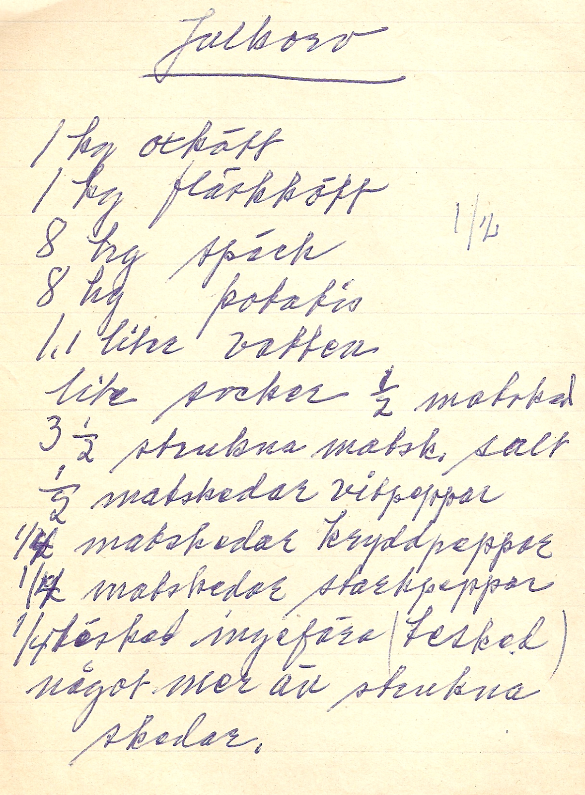  
  
- 1 kg oxkött  
- 1 kg fläskkött  
- 8 hg späck  
- 8 hg potatis  
- 1,1 liter vatten  
- litet socker (½ matsked)  
- 3½ strukna matskedar salt  
- ½ matskedar vitpeppar  
- 1/4 matskedar kryddpeppar  
- 1/4 matskedar starkpeppar  
- 1/4 torkad ingefära (tesked)  
  
Något mer än strukna skedar.  
  
  
## Káposztás tészta – ungerska pastarutor med stekt vitkål  
4 portioner. Tillagningstid 1 timme. Degknådningen kräver en viss vana.  
### Ingredienser  
- Till deg – det går också bra med lasagneplattor  
	- 400 g vetemjöl  
	- 4 ägg  
	- 1 krm salt  
- 1 litet vitkålshuvud  
- 1 msk socker  
- salt, vitpeppar  
- margarin eller smör  
  
### Gör så här  
1. Riv kålen ganska fint, salta den något och låt den stå en stund.  
2. **Om du gör egen deg:** Knåda mjöl, ägg och salt till deg som får vila 20–30 minuter.  
3. Krama ur den rivna kålen och fräs den i matfett med socker, salt och peppar.  
4. **Om du gör egen deg:** Kavla ut degen så tunt som mjöligt. Låt den lufttorka en stund. Vik den och skär till små kvadrater, 1×1 cm.   
5. **Om du använder lasagneplattor:** dela lasagneplattorna i små kvadrater, 1×1 cm.   
6. Koka degrutorna i saltat vatten c:a 5 minuter.  
7. Häll av vattnet och blanda med kålen.  
  
*Källa: Irene*  
  
  
## Kasslergratäng  
  
4 personer. Ugnstemperatur 225ºC  
  
    
- 6 portioner ris  
- 400 g kassler  
- 1 liten purjolök  
- 3 dl grädde  
- 3/4 dl majonnäs  
- 3/4 dl chilisås  
- 1 burk skivad ananas  
- 2–3 dl riven ost  
  
1. Koka riset och lägg i en ugnsfast form.  
2. Skiva kasslern, bräck skivorna och lägg dem över riset i formen.  
3. Lägg på ananasskivor och skivad purjolök.  
4. Vispa grädden och blanda i majonnäs och chilisås.  
5. Häll blandningen i formen och strö över riven ost.  
6. Gratinera i c:a 20-25 minuter.  
  
## Kinesisk kål med svamp  
  
4 portioner (ICA-kuriren nr 3, 1982)  
  
- 4 msk olja  
- ½ tsk salt  
- 100 g svamp  
- 1 huvud kinesisk kål  
- 2 msk soja  
- 1 tsk socker  
- 1 dl vetemjöl  
- 2 msk vatten  
  
1. Skär kålen i bitar och svampen i halvor.  
2. Hetta upp oljan i pannan. Salta.  
3. Lägg i svampen och rör om.  
4. Tillsätt kålen och sänk värmen.  
5. Tillsätt soja, socker och vatten.  
6. Lägg på lock och låt stå på svag värme i 5 minuter.  
7. Vattnet ska nästan koka in.  
  
  
## Kokt kött  
  
Tillagningstid 2½ timme  
  
  
- 1–3 kg benfritt nötkött av bog, bringa eller högrev  
- 2 tsk salt per l vatten  
- 1 gul lök  
- 1 morot  
- 10 vit- eller svartpepparkorn  
- 1 lagerblad  
  
1. Lägg köttet i en kastrull. Mät och häll på vatten så att det täcker.  
2. Tag upp köttet och koka upp vattnet.  
3. Lägg köttet i det kokande vattnet tillsammans med salt, kryddor och grönsaker i bitar.  
4. Låt köttet koka på svag värme 1½–2 timmar.  
  
  
## Kolbász (Iréns köttkorv)  
  
- 1 kg köttfärs  
- 3–4 hg fläskfärs  
- 1 liten gul lök  
- 4 klyftor vitlök  
- c:a 2 msk stark paprika  
- salt  
- fjälster  
  
1. Blanda allt och låt smeten vila minst 3 timmar.  
2. Stoppa i fjälster.  
  
  
## Lövbiffsgratäng  
  
4 personer. Ugnstemperatur 225º–250ºC  
  
  
- 4 portioner ris  
- 400 g lövbiff  
- 1–2 gula lökar  
- 200 g champinjoner på burk  
- 1 påse béarnaisesås  
- 2–3 dl riven ost  
  
1. Koka riset.  
2. Strimla och stek lövbiffen. Lägg bitarna i en eldfast form.  
3. Bryn lök och champinjoner tillsammans i stekpannan.  
4. Lägg blandningen över lövbiffen och lägg riset överst.  
5. Koka upp béarnaisesåsen och häll den över. Strö över riven ost.  
6. Gratinera i c:a 20 minuter.  
  
## Mustig morotssoppa  
(Annika Sundin 9 februari 1988)  
  
  
- 3 skalade morötter  
- 2 gula lökar  
- 4 tomater  
- olja  
- solroskärnor  
- 1 buljongtärning  
- 1 l vatten  
- peppar  
- salt  
- ingefära  
  
1. Skär lök och tomater fint och riv morötterna.  
2. Fräs löken mjuk i oljan, ganska länge.  
3. Pudra litet ingefära över.  
4. Öka värmen, tillsätt mera olja och fräs igenom morötterna en bra stund.  
5. Häll i tomater och solroskärnor mot slutet.  
6. Späd med buljong, salta och krydda.  
7. Låt koka en stund.  
  
## Nettans lilla varma smörgåstårta  
  
C:a 4 bitar. Ugnstemperatur 225ºC (Vår bostad nr 5, 1997)  
  
- 6 skivor vitt landgångsbröd  
- 4–5 dl riven, lagrad ost  
- 2–3 tomater  
- persilja  
  
Fyllning 1:  
- smör eller margarin  
- 1 gul lök  
- 1 paket bacon  
- c:a 2 hg kantareller  
- 2–3 msk pepparrot  
- 1 msk vetemjöl  
- 2 dl matlagningsgrädde  
- salt och peppar  
  
  
Fyllning 2:  
- 4 hårdkokta ägg  
- 1 knippa dill  
- 1½ dl majonnäs  
- salt och peppar  
  
1. Skala och hacka löken. Skär bacon i tärningar och dela svampen i bitar.  
2. Bryn bacon, lök och svamp under omrörning i en stekpanna.  
3. Smaksätt med pepparrot.  
4. Strö över mjölet, rör om och späd med grädden.  
5. Låt koka upp och sjuda ett par minuter.  
6. Smaka av med salt och peppar och låt svalna.  
7. Skala och hacka äggen. Hacka dillen.  
8. Blanda hacket med majonnäs och smaka av med salt och peppar.  
9. Lägg två brödskivor på en plåt med bakplåtspapper och täck med baconfyllningen.  
10. Lägg två skivor ovanpå och bred över äggfyllningen.  
11. Lägg på de översta skivorna och strö över osten.  
12. Skiva tomaterna och lägg på dem.  
13. Sätt in i övre delen av ugnen och grädda tills osten smält och fått litet färg.  
14. Dekorera med persilja.  
  
  
## Pastagratäng  
  
4 personer. Ugnstemperatur 250ºC  
  
    
  
- 4 portioner kokt pasta  
- 200 g champinjoner på burk (inkl. spad)  
- 2 msk margarin  
- 2½ msk vetemjöl  
- 2 dl mjölk  
- 1 dl vispgrädde  
- ½ tsk salt  
- 2 krm svartpeppar  
- 3 tomater  
- 2 dl riven ost  
  
1. Lägg pastan i en smord ugnssäker form.  
2. Fräs svampen. Strö över mjölet och rör om.  
3. Späd med svampspad, mjölk och vispgrädde.  
4. Koka på svag värme c:a 10 minuter Smaka av med salt och peppar.  
5. Bred stuvningen över pastan.  
6. Skiva tomaterna och lägg dem ovanpå. Strö över osten.  
7. Gratinera i 10–15 minuter.  
  
  
## Porterstek  
  
12 portioner. Tillagningstid 3 timmar  
  
    
  
- 1½ kg benfritt nötkött (bog, fransyska, ytterlår)  
- 1 flaska porter  
- ½–1 dl outspädd svartvinbärssaft  
- 1 dl soja  
- 1 tsk timjan  
- 5–6 enbär  
- 5–6 svartpepparkorn  
- 2–3 köttbuljongtärningar  
- 2 vitlöksklyftor  
- 1 stor, gul lök  
  
  
  
Sås:  
- 8 dl sky  
- 5 msk vetemjöl  
- 2 dl grädde  
  
1. Välj en gryta så stor att termometer och kött lagom får plats.  
2. Häll i porter, saft och soja.  
3. Lägg i kryddor, buljongtärningar, ituskurna vitlöksklyftor och gul lök delad i stora bitar.  
4. Koka upp. Stick in en köttermometer i steken så att spetsen kommer mitt i den tjockaste delen. Hela röret bör vara inne.  
5. Lägg köttet i lagen. Låt alltsammans sakta sjuda under lock. Vänd på steken en gång under kokningen.  
6. Tag grytan från värmen när innertemperaturen är 75º (ytterlår 85º) efter 1½–2 timmar. Låt steken ligga 20 minuter i skyn innan den skärs upp.  
7. Rör ut vetemjölet i litet av grädden. Koka upp grädden tillsammans med skyn.  
8. Rör ner redningen och låt såsen koka 3–5 minuter.  
  
## Raggmunk med kornmjöl  
  
4 portioner. Tillagningstid 45 minuter  
    
  
- 3 stora potatisar  
- 2 ägg  
- 3 dl mjölk  
- 2 dl kornmjöl  
- 1 tsk salt  
- fläskflott, smör eller margarin  
  
1. Skölj och skala potatisen.  
2. Riv den grovt på rivjärn.  
3. Vispa samman ägg, mjölk, kornmjöl och salt.  
4. Blanda ned potatisen i äggsmeten.  
5. Hetta upp fett i en stekpanna och stek raggmunkarna frasiga.  
6. Servera med lingonsylt, strimlad vitkål och stekt fläsk.  
  
  
## Randig grönsaksterrin  
  
2 portioner. Tillagningstid 1 timme. Ugnstemperatur 175ºC  
  
    
  
- 2 hg morötter  
- 2 hg purjolök  
- ¼ krm svartpeppar  
- 1 tsk potatismjöl  
- 1 dl lätt-crème-fraîche  
- 1 ägg  
  
1. Lägg 2 hg rivna morötter i en skål och 2 hg finstrimlad purjolök i en annan.  
2. Blanda i varje skål ner en sats av övriga ingredienser.  
3. Varva grönsakerna i smord 1½-litersform och grädda i 40 minuter.  
  
## Renskavsgryta  
  
2–3 portioner. Tillagningstid ½ timme. Mikrovågsugn  
  
    
  
- 250 g renskav  
- ½ tsk salt  
- 1 krm peppar  
- 2 tsk vetemjöl  
- 1½ dl buljong  
- 1½ dl gräddmjölk  
- ½ dl råröda lingon  
- syltlökar  
- soja  
  
1. Tina och ta isär köttet med gaffel.  
2. Tillsätt salt, peppar och vetemjöl.  
3. Rör om och blanda ner de övriga ingredienserna.  
4. Värm på full effekt (750 W) i sju minuter. Rör om någon gång under tiden.  
5. Servera med potatismos, kokt potatis eller ris samt grönsaker.  
  
  
## Ungersk bönsoppa på brytbönor – Bableves  
  
6 portioner. Tillagningstid 1 timme    
    
Ingredienser:    
- 2 msk margarin    
- 2 msk vetemjöl    
- 2 tsk paprika    
- ½ buljongtärning    
- ½ lök    
- ½ l vatten    
- salt, socker    
- 2 msk persilja    
- ½ tsk ättiksprit    
- ½ dl grädde    
- förvällda brytbönor    
    
  
1. Fräs margarin, mjöl och paprika i en kastrull.  
2. Tillsätt buljongtärning, lök och vatten. Koka tills löken är mjuk.  
3. Krydda soppan, smaka av med grädde och lägg i bönorna. De skall inte koka sönder.  
  
Serveras med gott bröd.    
Källa: Irene  
  
  
## Ungerska kåldolmar  
  
16 st. Tillagningstid 2 timmar. Ett relativt krävande recept.  
  
    
  
- 5 dl ris  
- vitkålshuvud (3 kg)  
- 750 g blandfärs  
- 750 g köttfärs  
- 2 lökar  
- 1 dl tomatpuré  
- 2 msk paprika  
- salt, vitpeppar  
- ½ l vatten  
- 300 g margarin  
  
1. Blötlägg riset någon timme.  
2. Koka vitkålshuvudet i vatten tills det mjuknar.  
3. Skär längsmed runt stocken. Ta av bladen till omhölje.  
4. Grovhacka resten av kålstocken och koka med en finhackad lök i en stor kastrull.  
5. Mjukgör i en annan kastrull en lök i 150 g margarin.  
6. Blanda under tiden färs, ris (okokt), tomatpuré, paprika, vitpeppar och salt och lökfyllningen från den lilla kastrullen i en bunke.  
7. Tag 100–150 g margarin och smält i den nu tomma lilla kastrullen. Rör i c:a 2 dl mjöl och låt sjuda minst 15 min. till en ganska tjock röra.  
8. Fyll under tiden halva vitkålsblad (riv av dem på längden) med ½–¾ dl av fyllningen. Vik liksom en strut genom att vika och sedan trycka till överdelen.  
9. Lägg kåldolmarna ovan på de kokta kålresterna i den stora kastrullen och koka upp.  
10. Tillsätt under tiden i den lilla kastrullen 1 msk paprika, ½ l vatten och ½ dl tomatpuré. Salta ev. såsen litet.  
11. Häll såsen ovanpå kåldolmarna när de kokat c:a 30 minuter.  
  
    
  
Källa: Irén  
  
## Vardagsenkla våfflor  
  
14 laggar  
  
  
- ½ hg smör el. margarin  
- 2 ägg  
- 6 dl mjölk  
- 5 dl vetemjöl  
- ½ tsk salt  
  
1. Smält matfettet och låt det svalna.  
2. Vispa äggen och tillsätt 3 dl av mjölken.  
3. Blanda i mjölet och rör smeten jämn.  
4. Tillsätt resten av mjölken, saltet och matfettet.  
5. Hetta upp våffeljärnet, pensla med litet matfett till första laggen.  
6. Häll i c:a 3/4 dl smet till varje våffla och grädda dem guldgula.  
7. Lägg de gräddade våfflorna på galler.  
  
## Våffelgås med salta tillbehör  
  
1 st  
  
2 skivor vitt bröd  
  
Fyllning 1:  
- 2 msk smältost  
- 1 tsk kaviar  
- klippt dill  
  
Fyllning 2:  
- 2 msk böcklingpastej  
- 1–2 tsk finhackad lök  
  
Fyllning 3:  
- 1 msk crème fraîche  
- 2 tsk röd kaviar  
- finhackad lök    
  
Fyllning 4:  
- 2 msk leverpastej  
- 2 tsk finhackad gurka  
- hackad persilja  
  
1. Välj en av fyllningarna och bred på den ena brödskivan.  
2. Lägg den andra brödskivan över.  
3. Hetta upp våffeljärnet.  
4. Lägg i våffelgåsen och grädda den guldbrun.  
5. Servera den genast med t.ex. grönsallad.  
  
## Våffelgås med söta tillbehör  
  
1 st  
  
- 2 skivor vitt bröd  
    
Fyllning 1:  
- 1 msk crème fraîche  
- 2 tsk russin  
- rivet citronskal  
  
Fyllning 2:  
- 1 msk lemon curd  
- grovhackad blockchoklad  
  
Fyllning 3:  
- 1 msk äppelmos  
- kanel  
- kardemumma  
  
1. Välj en av fyllningarna och bred på den ena brödskivan.  
2. Lägg den andra brödskivan över.  
3. Hetta upp våffeljärnet.  
4. Lägg i våffelgåsen och grädda den guldbrun.  
  
Servera den genast: som efterrätt eller till kaffe eller te.  
  
# Efterrätter  
  
  
## Apelsinglass  
  
4 portioner. Tillagningstid 1 timme  
  
    
  
- 4 äggulor  
- 4 msk socker  
- 2 tsk vaniljsocker  
- 2½ dl vispgrädde  
- 2 äggvitor  
- 1 dl apelsinjuice eller 2 pressade apelsiner  
- ev. 2 msk Grand Marnier  
  
1. Vispa äggulor och socker tillsammans samt äggvitor och grädde var för sig till skum.  
2. Rör ner jos, grädde och ev. likör i äggulesmeten och vänd till sist ner äggvitorna. Rör om försiktigt.  
3. Häll blandningen i en form och låt den stå i frysen c:a 2 timmar. Tag ut den då och då och rör om litet.  
4. Låt den sedan stå 6–7 timmar i frysen.  
5. Tina en liten stund före servering.  
  
  
## Banan- och ananasglass  
4–6 portioner (mjölkpaket 19 juni 1988)  
  
- 3 äggulor  
- 1 dl socker  
- 2 dl mjölk  
- 2 bananer  
- 2 dl ananaskross, väl avrunnen  
- 2 dl vispgrädde  
  
1. Vispa ihop äggulor, socker och mjölk i en kastrull.  
2. Sjud blandningen tills den tjocknar, 2–3 minuter. Låt svalna.  
3. Mosa bananerna.  
4. Blanda äggsmeten med banan och ananas.  
5. Vispa grädden hårt och rör ned den.  
6. Häll smeten i en form och ställ den i frysen.  
7. Rör om några gånger under infrysningen som tar c:a 6 timmar.  
8. Tina i kylskåp 20–30 minuter före servering.  
  
  
## Korngrynspannkaka  
  
4 portioner. Tillagningstid (förutom grötkokning) 1 timme. Ugnstemperatur 200ºC  
   
  
- ½ sats korngrynsgröt  
- 2 ägg  
- 2 msk socker  
- 1 tsk stött koriander eller ½ tsk stött kardemumma  
- 20 blötlagda aprikoser eller 2 skivade äpplen  
- ½ dl hasselnötter  
- 2 msk socker  
- smör  
  
1. Vispa upp äggen och rör ned dem i gröten.  
2. Smaksätt med socker och kryddor.  
3. Häll smeten i en smord ugnssäker form.  
4. Tryck ned aprikoser eller äppleskivor.  
5. Hacka nötterna och blanda med sockret. Strö det över och klicka smör på.  
6. Grädda i c:a 40 minuter.  
7. Servera pannkakan ljummen med mjölk eller grädde.  
  
  
  
  
# Tillbehör  
  
  
  
## Chokladsås på honung  
  
4–6 portioner. Tillagningstid 15 minuter  
  
    
  
- 1 dl honung  
- 1 dl kakao  
- högst 1 dl vatten, beroende på honungen  
- ev. salt, beroende på honungen  
  
1. Låt honungen smälta i mikron.  
2. Skaka kakaon med vatten i sluten redningsbägare så att klumparna försvinner.  
3. Värm alltsammans och smaka ev. av med salt. Se upp så att det inte blir för salt. Kan förvaras flera veckor i kylskåp t.ex. i burk.  
  
## Flädersaft  
Ger 4 liter. Tillagningstid 1,5 timme (6 dagar), marmelad inte inräknad  
### Ingredienser  
- 40 klasar fläderblommor  
- 3 l vatten  
- 3 l socker = 2,7 kg  
- 3 citroner, skivade, gärna ekologiska  
- 50 g citronsyra  
- natriumbensoat  
  
### Gör så här  
1. Blanda vatten, socker, tvättade citroner och citronsyra och koka upp.  
2. Häll uppkoket över de rensade och sköljda klasarna och låt stå i fem dygn.  
3. Sila saften och konservera med natriumbensoat.  
  
*Koka sedan marmelad på citronerna. Det går fint att frysa in dem och göra marmeladen senare. Använd syltsocker – det är enklast.*  
  
## Grönkålschips  
Sätt ugnen på 150 grader. Varmluft fungerar bra. Ugnstid 3x5 minuter, alltså totalt cirka 15 minuter.  
### Ingredienser  
- Långpanna, gärna med bakplåtsduk  
- Handriven grönkål, så mycket som ryms på långpannans botten  
- 2 till 3 matskedar olja  
- 1/3 tesked salt  
- 0,5 till 1 matsked vinäger, t.ex. balsamvinäger  
  
### Gör så här  
  
  
Klart att värma  
  
1. Om grönkålen behöver sköljas, torka den lite innan du gör vid den  
1. Beräkna mängden grönkål genom att fylla långpannan med grovriven grönkål  
1. Lägg grönkålen i en plastpåse och tillsätt olja, salt och vinäger  
1. Platta till påsen och massera grönkålen med marinaden någon minut  
1. Fördela grönkålen jämnt i långpannan  
1. Grädda mitt i ugnen fem minuter  
1. Ta ut långpannan och rör ev. om med stekspade. Sätt in den igen, gärna vänd 180 grader mot förut  
1. Grädda cirka fem minuter till.  
2. Ta ut och vänd plåten en gång till och grädda cirka fem minuter.  
3. Bevaka noga de sista minuterna. Grönkålen i mitten ska vara knaprig men undvik att kålen närmast kanterna blir brun  
4. Häll direkt från bakplåtsduk till serveringsskål så går chipsen inte sönder så mycket :)  
  
  
Serveringsklart  
  
## Inlagd gurka  
  
4 kg gurkor    
1,5 l vatten    
5 dl ättika    
1,5 kg socker    
20 pepparkorn    
2–3 muskotblommor    
dill    
1 till 1,5 dl peppar    
ev. senapsfrö    
vinbärsblad    
lite salt    
    
Lägg gurkorna i saltlake c:a 10 timmar: 100 g salt per kilo gurka. Häll bort saltlaken.    
    
Koka upp lagen och låt den kallna. Lägg gurkorna i lagen.  
  
  
## Korngrynsgröt  
  
4 portioner. Tillagningstid 1 timme  
  
- 2 dl korngryn  
- 5 dl vatten  
- salt  
- 5 dl mjölk  
  
1. Koka upp vatten och salt och rör ner korngrynen.  
2. Låt koka under lock c:a 10 minuter tills vattnet kokat in.  
3. Späd med mjölk och koka ytterligare c:a 25 minuter. Rör om då och då.  
  
## Müsli  
Ugnstemperatur 150ºC  
  
  
- 2 dl havregryn  
- 2 dl rågflingor  
- 1 dl vetegroddar  
- 1 dl vetekli  
- 1 dl linfrö  
- 1 dl hackade hasselnötter  
- ½ kaka knäckebröd  
- 3 msk honung  
  
1. Kavla knäckebrödet i en plastpåse.  
2. Blanda allt utom honung i en långpanna.  
3. Värm honungen och ringla över den.  
4. In med müslin i ugnen c:a 20 minuter.  
5. Rör om då och då under rostningen.  
  
  
## Morfars senap – mörk & kornig  
- 1,5 msk gult senapsfrö  
- ½ dl brunt senapsfrö  
- 1 dl vatten  
- 3/4 msk vinäger  
- ½ msk socker – ev. brun farin eller annan sötning  
- ½ tsk salt  
- 1,5 msk olja  
- (½ msk mald dragon efter tycke)  
  
1. Krossa senapsfrön i mortel, ungefär halva mängden i taget. Börja att krossa fröna *utan* vatten.  
2. Tillsätt sedan litet vatten i sänder varefter det sugs upp av fröna. Vattnet ska vara med för att senapen ska få rätt konsistent och smak.  
3. Blanda senapen med vinäger, socker och ev. söndersmulad dragon  
4. Rör sist ned oljan  
  
Senapen blir mognare i smaken om den får stå några dagar. Båda senapssorterna kan förvaras en längre tid i kylskåp. De blir starkare än färdigköpt senap. Senapen kan också krossas i ett fat med senapskula.  
  
## Morfars senap – slät & stark  
  
- 1,5 dl senapspulver  
- 1 msk mjöl – vete eller valfritt  
- 1,5 dl vatten eller buljong  
- salt efter smak  
- 1,5 msk vinäger  
- 3 msk socker eller valfri sötning  
- 2 msk olja  
  
## Nokedli. Nykokt färsk pasta på ungerska  
  
4 portioner. Tillagningstid 45 minuter  
  
- 4 ägg  
- salt  
- 5 dl vetemjöl  
- smör  
  
1. Blanda ägg, salt och mjöl till en litet kladdig deg.  
2. Koka upp vatten och salt i en kastrull.  
3. Tryck ut degen från baksidan genom ett grovt rivjärn direkt ned i det kokande vattnet  
4. Låt koka några minuter.  
5. Spola de färdiga nokedli med kallt vatten och blanda med litet smör.  
  
Källa: Irene  
  
## Pizzasallad  
  
### Ingredienser  
- 1 liter riven vitkål  
- 1 vitlöksklyfta  
- ½ dl olja  
- 1 dl matättika  
- 2 tsk salt  
- 2 tsk strösocker  
- ½ tsk grovmalen svartpeppar  
- 1 tsk senapspulver, krossade senapsfrön eller senap  
- 1 tsk basilikum eller oregano  
  
### Gör så här  
1. Matättikan får du genom att blanda ut ättiksprit med vatten (1 del ättiksprit till 6 delar vatten)  
1. Strimla vitkålen med en osthyvel om du vill ha en finstrimlad kålsallad, skär med kniv om du vill ha en grövre.   
   - Lägg i kallt vatten om du vill att den ska bli spröd  
3. Pressa vitlöken med vitlökspress  
4. Blanda allt utom vitkålen i en kastrull och låt det småputtra några minuter under lock. Häll det varmt över vitkålen och rör om  
5. Låt stå svalt åtminstone tio minuter  
  
*Salladen håller minst en vecka i kylen*  
  
## Rödbetor (röbedor)  
  
Tillagningstid 1 timme  
  
    
- 1½ dl ättiksprit  
- 5 dl vatten  
- 1½ dl socker  
- 5 nejlikor  
- 1 tsk natriumbensoat  
- (vitlök)  
- (senapsfrö)  
- 10 kryddpepparkorn  
- ½ lagerblad  
- pepparrot  
  
## Rödkål  
Tillagningstid 2 timmar  
### Ingredienser  
- 1 kg rödkål  
- 35 g smör eller margarin  
- 2 äpplen med skal  
- 1 gul lök  
- 1½ dl russin  
- 1 tsk salt  
- 7 kryddnejlikor  
- 7 kryddpepparkorn  
- 2½ msk sirap  
- (några skedar rödbetslag)  
- ½ dl rödvinsvinäger  
- 1 dl rödvin  
  
### Gör så här  
1. Strimla kålen med osthyvel. Fräs den i matfettet  
2. Tag bort det grövsta på äpplena och lägg i äpplen och lök i kålen  
3. Blanda ner resten av ingredienserna medan kålen kokar  
  
## Salta pinnar  
  
Ugnstemperatur 200ºC  
  
- 175 g smör  
- 25 g jäst  
- 2 dl vatten  
- 1 msk salt  
- 1 tsk socker  
- ½ dl parmesanost  
- 11 dl vetemjöl  
  
  
Garnering:  
- grovt salt  
  
1. Smält smöret, blanda i vattnet och värm till 37ºC.  
2. Smula sönder jästen i en degbunke.  
3. Häll i hälften av degspadet och rör om.  
4. Tillsätt resten av spadet och övriga ingredienser.  
5. Arbeta degen smidig och låt den jäsa i c:a 40 minuter.  
6. Rulla degen till pinnar som får jäsa på plåt i c:a 20 minuter.  
7. Pensla med vatten och strö på grovt salt.  
8. Grädda i 15-20 minuter.  
9. Låt kallna på galler utan bakduk.  
  
  
## Slånsaft  
  
Tillagningstid en vecka (c:a 2 timmar)  
  
  
- 500 g socker per liter saft  
- kaliumsorbat eller natriumbensoat q.s.  
  
1. Lägg slånbären i en hink och fyll vatten så att det precis täcker bären.  
2. Koka upp vattnet, begjut bären och låt dem stå i 1–3 dygn.  
3. Upprepa proceduren två gånger. Det hela bör ta mindre än en vecka sammanlagt.  
4. Sila av saften, koka upp den och skumma av med hålslev eller skumningsslev. Skummet kan användas som smaksättning t.ex. i yoghurt.  
5. Tillsätt socker.  
6. Rör ut kaliumsorbat i en halv deciliter saft. Ta kastrullen från spisen innan konserveringsmedlet rörs i noga.  
7. Låt saften svalna något innan den hälls på rena, värmda flaskor.  
  
## Tagliatelle  
4 personer (UNT 5 augusti 1982)  
  
    
  
- 450 g vetemjöl  
- 5 ägg  
- 1 tsk salt  
- 2 msk olivolja  
- 2 msk kallt vatten  
  
1. Blanda ingredienserna med en gaffel tills degen går att forma till en boll (tillsätt ev. mera vatten).  
2. Knåda degen c:a 15 minuter så att den blir elastisk.  
3. Dela den i 6 delar.  
4. Kavla på mjölat bakbord ut bitarna till långa tunna plattor. Använd rikligt med mjöl så att degen inte fastnar.  
5. När plattan är tillräckligt tunn, dofta över mjöl och rulla till en lös rulle.  
6. Skär den sedan i halvcentimeterbreda remsor.  
7. Sära på degremsorna och låt dem ligga kvar och torka några minuter.  
8. Koka i rikligt med saltat vatten 1–1½ minut.  
  
  
## Örtpastej  
- 2 dl solrosfrön  
- ½ dl sesamfrö  
- ½ dl sötmandel  
- 1–2 knippor dill  
- ½ gul lök  
- ½ tsk timjan  
- ½ tsk kyndel  
- 2–2½ msk tomatpuré  
- 2–3 tsk äppelcidervinäger  
- 3/4–1 dl buljong  
- 1 msk soja  
  
1. Mal frön, mandel och lök och häll i en skål.  
2. Hacka dill och stöt örtkryddorna fint.  
3. Blanda i kryddorna och rör massan slät.  
4. Tomatpurén kan bytas ut mot finriven morot.  
  
___  
Kuriosa: 212 g = 1 mark = ½ skålpund  
