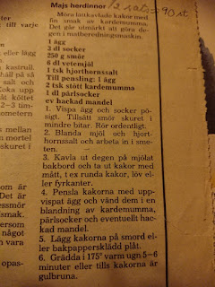
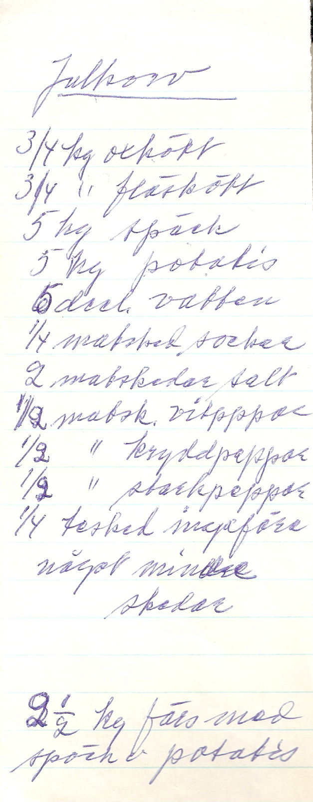
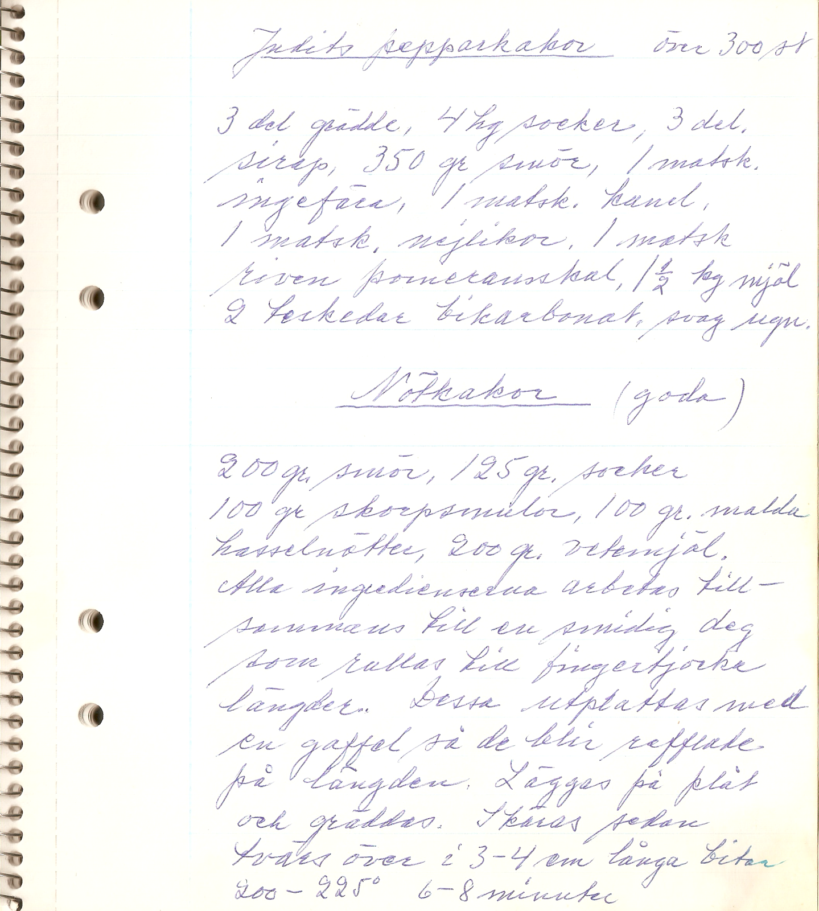

# Våra favoritrecept på svenska
{: .no_toc }

  

    Innehåll
  

  {: .text-delta }
- TOC
{:toc}

# Baka
## Haralds rågbröd (morfarsbröd)
6 levar. Tillagningstid 2 dagar. Ugnstemperatur 200 ºC
### Ingredienser
#### Dag 1
- 1 l filmjölk
- 100 g jäst
- rågmjöl

#### Dag 2
- 1 liter varmt vatten
- ½ liter mjölk
- c:a 3 kg rågsikt
- ev. mer rågmjöl

### Gör så här
1. Smula jästen i stor degbunke. Tillsätt filmjölk och så mycket rågmjöl att det blir en lös deg.
2. Täck över och låt jäsa över natten.
3. *Dag 2:* Tillsätt vätska och det mesta av mjölet. Arbeta degen ordentligt, tag ev. upp den på bakbord och lägg tillbaka i bunken igen. Låt degen jäsa några timmar.
4. Tag upp den på bakbordet och knåda den väl med det sista av mjölet tills den är fast och smidig.
5. Låt den helst jäsa ytterligare en stund innan den bakas ut till rejäla levar som får jäsa till dubbel storlek, tre på varje plåt.
6. Grädda i c:a ¾ timme.
7. Tag ut och knacka på undersidan av brödet. Låter det ihåligt är det klart. Låt svalna på galler under bakduk.

## Majs herdinnor
Möra, lättkavlade kakor med fin smak av kardemumma. Det går utmärkt att göra degen i matberedningsmaskin. Recept för cirka 3 bakplåtar.

Ugn: 175 °C
### Ingredienser
- ½ ägg
- 1½ dl socker (135 g)
- 125 g smör
- 3 dl vetemjöl (180 g)
- ½ tsk hjorthornssalt

Till pensling: 
- ½ ägg
- 1 tsk stött kardemumma
- ½ dl pärlsocker
- ev. hackad mandel

### Gör så här
1. Vispa ägg och socker pösigt. Tillsätt smör skuret i mindre bitar. Rör ordentligt.
2. Blanda mjöl och hjorthornssalt och arbeta in i smeten.
3. Kavla ut degen på mjölat bakbord och ta ut kakor med mått, t.ex. runda kakor, löv eller fyrkanter.
4. Pensla kakorna med uppvispat ägg och vänd dem i en blandning av kardemumma, pärlsocker och eventuellt hackad mandel.
5. Lägg kakorna på smord eller bakpappersklädd plåt.
6. Grädda i 175 graders varm ugn 5 till 6 minuter eller tills kakorna är gulbruna.

Källa: tidningen [Land](https://www.land.se/), 1981

## Marsipan
Tillagningstid 1½ timme 
- 3 msk mjöl
- 1 msk margarin
- 1 dl grädde
- 3 bittermandlar
- 1½ dl mandel (100 g)
- 2 dl florsocker (100 g)

Skålla den vanliga mandeln. Riv mandlarna, bittermandlarna extra noga. Blanda med övriga ingredienser.

## Pogácsa – små ungerska ostbollar
En släkting till [focaccia](https://hu.wikipedia.org/wiki/Pog%C3%A1csa)! [Här är ett annat välskrivet recept på engelska](https://thebakingwizard.com/hungarian-cheese-biscuits-pogacsa/)

C:a 50 st. Ugnstemperatur 200ºC
### Ingredienser
- ½ kg vetemjöl
- ½ kg margarin/smör
- 3 dl gräddfil eller crème fraîche
- mjölk
- 1 tsk socker
- 25 g jäst
- 1 tsk salt
- 2 äggulor
- riven ost

### Gör så här
1. Värm mjölk och gräddfil till fingervarmt. Tillsätt socker
1. Smula i jästen, tillsätt äggulor och rör om
1. Smula ihop mjöl och smör samt salt
1. Tillsätt degspadet och knåda till en smidig deg
1. Kavla ut till halvtjock platta och bestryk med margarin
1. Vik ihop degen 3x3. Låt jäsa 5 minuter
1. Kavla ut och vik åter ihop 3x3. Låt jäsa 5 minuter
1. Upprepa ytterligare två gånger
1. Kavla ut degen centimetertjock
1. Stansa ut små runda kakor med ett litet glas
1. Gör rutmönster med kniv och strö över riven ost
1. Grädda i cirka 20 minuter tills de får lite färg

Källa: Irene 1995-08-02

## Vaniljkakor (Dagmars receptsamling)

1 hg smör, 2 st ägg, 2 hg socker, 4 teskedar vaniljsocker, 4 hg vetemjöl, 1 tesked hjorthornssalt

Smöret röres tillsammans med sockret tills det blir pösigt. Äggen uppvispas och röres. Vaniljsocker och hjorthornssalt blandas med en del av mjölet och röres varefter resten av möjlet inarbetas. Kakorna göres runda. Gräddas i svag ugn.

## Uppåkrakakor (Dagmars receptsamling)

425 gram smör, 160 gram socker, 210 gram potatismjöl, 425 gram vetemjöl  

_Till pensling:_ 2 ägg, 50 gram sötmandel, en halv kaffekopp pärlsocker.

Smöret röres med sockret och de båda mjölsorterna arbetas in. Degen kavlas ut till omkring 2 millimeters tjocklek och med ett mått tages ut runda kakor som vikas ihop nästan på på mitten. Kakorna penslas med uppvispat ägg och beströs med mandel och socker. De gräddas mycket väl i god ugnsvärme. (omkr. 90 st.)

## Tårta (Dagmars receptsamling)

**3 äggulor, 1 dl socker** vispas hårt. **1½ dl smör** smältes. **5 msk mjölk, 1½ dl mjöl, 2 teskedar bakpulver** blandas ner. Smeten bredes ut på smörpapper i en långpanna. Vitorna och **2 deciliter socker** vispas hårt och bredes ovanpå den andra smeten; hackade nötter eller mandel strös på. Sättes in i ugnen i **150 grader i 30 till 40 minuter**. Dela kakan på mitten och lägg **3 deciliter vispad grädde och jordgubbar eller hallon** emellan.

## Sandbröd – flottyrringar – struvor (Dagmars receptsamling)

### Sandbröd

240 g smör, 120 g socker, 360 g mjöl arbetas tillsammans. Kavlas ut i vanlig tjocklek och tages ut med mått.

### Flottyrringar

2 äggulor, 1 kaffekopp grädde, väl en kaffekopp socker, 1 tesked jästmjöl, mjöl efter behov. (Jästmjöl kan bytas mot bakpulver)

### Struvor

3 ägg, ½ kaffekopp socker, 1 kopp vetemjöl, 1 kopp potatismjöl, 1½ kopp vatten, lite riven apelsinskal.

## Päron syltade med vin. Knäck. Pum-cake (ur Iduns hjälpreda, Dagmars receptsamling)

 Receptsida ur Iduns hjälpreda av okänt datum

### Päron syltade med vin

2½ kg oskalade päron, 1 kg socker, 3 dl vinättika, 3 dl vatten, 2 dl franskt vin 

_Beredning:_ Päronen skalas, blomfnaset borttagets, och ett kors skäres i päronet. Stjälken skrapas och afskäres till hälften. Päronen läggas efter skalningen i friskt vatten. Af sockret, ättikan och vattnet kokas en tunn lag, päronen ilägges och få koka, tills de äro klara och mjuka (omkring 3 timmar). De pröfvas genom att skära ett päron midt uti. Vinet tillsättes 15 minuter, innan päronen aflyftas från elden.   

### Knäck

½ liter grädde, ½ liter sirap, ½ liter socker, 1 kaffekopp stötta skorpor, 1½ hg sötmandel

_Beredning:_ Grädden, sirapen och sockret hällas i nu nämnda ordning i en järnkastrull, sättas öfver elden och få koka, tills smeten kännes tjock. Man profvar den genom att hälla några droppar i kallt vatten – stelnar den, så är knäcken färdig. De stötta skorporna iröras då, och knäcken får ytterligare koka 5 minuter. Sist iröres den skållade och hackade sötmandeln, och smeten slås genast upp i knäckformat.  

### Plum-cake

- 212 g smör,  
- 212 g mjöl,  
- 212 g socker,  
- 212 g korinter,  
- 212 g russin,  
- 5 ägg,  
- succat efter smak.  

_Beredning:_ Smöret röres med sockret till skum. Äggulorna tillsättas en i sänder, tillika med det väl torra och siktade mjölet och därefter den rensade frukten. Till sist nedskäras de till hårdt skum slagna hvitorna. Smeten slås i smort och brödbeströdd form; ofvanpå smeten läggas några tunt skurna succatskifvor. Kakan gräddas 2–3 timmar i medelmåttig ugnsvärme.

## Nötkakor. Finare vetebröd (Dagmars receptsamling)

### Nötkakor (1½ sats)

- 300 g smör  
- 190 g socker  
- 150 g skorpsmul  
- 150 g hasselnötter  
- 300 g vetemjöl  

### Finare vetebröd

- 1 l kall mjölk
- 4 hg smör smältes
- 180 g jäst
- 3 ägg
- 4 dl socker
- 2,2 dl vetemjöl
- 2 teskedar kardemumma eller mandel eller apelsinmarmelad

## Mördeg till paj. Spritsringar (Dagmars receptsamling)

### Mördeg till paj

½ kg smör, 3/4 kg mjöl, 2 ägg, 4–5 matskedar socker, 4 matskedar vatten

Smöret och mjölet arbetas väl tillsammans med äggen, som först slås med sockret, sedan vattnet. Degen kavlas ut till lagom tjocklek. Av denna sats blir det hälften över om man beräknar 6–7 personer.

### Spritsringar

140 g smör, 140 g socker, 1 äggula, 240 g mjöl. Massan går genom sprits.

## Min bästa sockerkaka. Johannisbitar (Dagmars receptsamling)

### Min bästa sockerkaka

**125 g margarin**, ej för kallt och styvt och **3 dl socker** arbetas tillsammans. När smeten blivit smidig tillsättes **2 ägg**, ett i taget. **3½ dl vetemjöl, 1 tsk bakpulver, rivet skal av en halv citron, 3/4 dl vatten** tillsättes så småningom under blandningen med mjölet. Gräddas i **medelvarm ugn c:a 45 minuter**.

### Johannisbitar, 23–25 st

1 hg smör, 1 hg mjöl, 2 matskedar socker. Smöret och sockret arbetas en stund, mjölet tillsättes lite i sänder. Degen formas till längder, som ställes på kallt ställe för att lättare skäras i runda bitar.

## Korintkakor (Agdas). Enkla kanelkransar (Dagmars receptsamling)

### Korintkakor (Agdas)

1½ hg smör, 2 kaffekoppar havregryn, 1 kkp socker, 1 tsk bikarbonat, 2 kkp mjöl, 1 kkp korinter. Alla ingredienserna blandas tillsammans och formas till runda bullar vilka gräddas i medelvarm ugnsvärme.

### Enkla kanelkransar (c:a 50 st)

Rör **1 ägg** med **100 g smör** och **100 g socker** ett par minuter. Sätt till **1 struken tsk hjorthornsalt** upplöst i **1 msk kokande vatten** och arbeta in **300 g vetemjöl**.

Låt degen stå kallt, helst till följande dag. Rulla ut degen i små längder, som formas till kransar vilka doppas i en blandning av **1 msk kanel** och **2 msk socker**. Medelvarm ugn.

## Knäck (Dagmars receptsamling)

½ liter grädde, ½ liter sirap, ½ liter socker, 1 kaffekopp stötta skorpor, 1½ hg sötmandel. Grädden, sirapen och sockret hälles i denna ordning i en kastrull och får koka till smeten kännes tjock.

## Knäck. Enkel kola. Gräddkola. Praliner. Ischoklad (Konsum/Kooperativa, ur Dagmars receptsamling)

Odaterade recept från Konsum/Kooperativa

## Kardemummakaka. Gunnels havrekakor. Alice kaffekaka (Dagmars receptsamling)

### Kardemummakaka

1 ägg, 1½ dl socker, 1½ dl mjölk, 4 dl vetemjöl, 2 tsk bakpulver, 1 tsk malen kardemumma, 100 g margarin, pärlsocker.

### Gunnels havrekakor

200 g smör, 4 msk socker, 1½ dl havregryn, 3 dl vetemjöl

### Alice kaffekaka

150 g smör röres, 2 koppar socker, 3½ koppar mjöl, 1 dl mjölk, 1 ägg, 2 teskedar jästmjöl (bakpulver), 1 tsk kardemumma. Kanel och mandel ovanpå pärlsocker. 40 minuter

## Julkorv 2 (Dagmars receptsamling)

- 1 kg oxkött
- 1 kg fläskkött
- 8 hg späck
- 8 hg potatis
- 1,1 liter vatten
- litet socker (½ matsked)
- 3½ strukna matskedar salt
- ½ matskedar vitpeppar
- 1/4 matskedar kryddpeppar
- 1/4 matskedar starkpeppar
- 1/4 torkad ingefära (tesked)

Något mer än strukna skedar.

## Julkorv 1 (Dagmars receptsamling)

- 3/4 kg oxkött
- 3/4 kg fläskkött
- 5 hg späck
- 5 hg potatis
- 5 dl vatten
- 1/4 matsked socker
- 2 matskedar salt
- ½ matsked vitpeppar
- ½ matsked kryddpeppar
- ½ matsked starkpeppar
- 1/4 tesked ingefära
	- något mindre skedar
- 2½ kg färs med späck och potatis

## Judits pepparkakor. Nötkakor (Dagmars receptsamling)

### Judits pepparkakor, över 300 st

3 dl grädde, 4 hg socker, 3 dl sirap, 350 g smör, 1 matsked ingefära, 1 matsked kanel, 1 matsked nejlikor, 1 matsked riven pomeransskal, 1½ kg mjöl, 2 teskedar bikarbonat. Svag ugn.

### Nötkakor (goda)

200 g smör, 125 g socker, 100 g skorpsmulor, 100 g malda hasselnötter, 200 g vetemjöl.

Alla ingredienserna arbetas tillsammans till en smidig det som rullas till fingertjocka längder. Dessa utplattas med en gaffel så de blir refflade på längden. Läggas på plåt och gräddas. Skäras sedan tvärs över i 3–4 cm långa bitar. 200–225 grader 6–8 minuter.

## Havresnitt c:a 45 st, goda (Dagmars receptsamling)

150 g smör, 1½ dl socker, 3 dl havregryn, 1 tsk bakpulver, 1½ dl vetemjöl.

Värm ugnen till 175–200 grader. Rör smör och socker pösigt. Blanda i de andra ingredieserna. Rulla ut degen till fyra längder lika lång som plåten och lägg dem på smord plåt. Grädda c:a 10 minuter. Längderna flyter ut under gräddningen. Skär sneda kakor medan längderna är varma.

## Havrekakor med russin resp. skurna i bitar (Dagmars receptsamling)

### Havrekakor med russin, c:a 50 st

125 g margarin, 3 dl havregryn, 1½ dl socker, 1½ dl russin, 3 msk vatten, 2 dl vetemjöl, 1 tsk hjorthornsalt.

Smält smöret och häll det över havregrynen i en skål. Blanda sedan i de andra ingredienserna. Klicka ut smeten på smorda plåtar. 10 min.

### Havrekakor, skurna i fyrkantiga bitar

1 kaffekopp smält smör, 1 kaffekopp socker, 3 kaffekoppar havregryn, (lite mjöl)

## Goda bullar. Smulpaj (Dagmars receptsamling)

### Goda bullar

½ liter gräddmjölk (kall mjölk), väl 1 hg jäst, 1½ hg smör, 1 par matskedar socker, mjöl. Jäses (endast på plåten). Innan de sättas in i ugnen penslas bullarna med smör och beströs med pärlsocker. Varm ugn, 250 grader.

### Smulpaj

7–8 äpplen, 6 msk socker, 2 tsk kanel (blandas).

2 kaffekoppar vetemjöl, 1 hg margarin, 1–2 msk socker blandas till en smulig deg. Degen bredes över klyftorna så de täcks. Gräddas i 200 graders värme tills den fått färg, c:a 20 minuter. Serveras med vaniljsås.

## Gifflar (Dagmars receptsamling)

100 g margarain, 1½ msk socker, 1 ägg, 30 g jäst, 1 dl grädde, 5½ dl vetemjöl

_Fyllning:_ apelsinmarmelad eller äpplemos

_Pensling:_ ägg, pärlsocker  

Rör matfett och socker pösigt. Blanda ner ägget, rör ut jästen i grädden och häll sedan i den. Tillsätt mjölet och arbeta hastighet ihop degen på bakbordet. Kavla ut den i två runda kakor. Sporra ut 8 snibbar ur varje kaka och lägg en klick marmelad på dessa. Rulla ihop snibbarna och forma dem till gifflar. Låt dem jäsa till knappt duppel storlek på smord plåt. Grädda i 275 grader c:a 5 minuter.

## Fru Möllers kringla. Bruna bröd (Ruths kakor) (Dagmars receptsamling)

texten kompletterad av Harald L.
### Fru Möllers kringla

½ kg vetemjöl, 125 g socker, 1 tesked kardemumma, 100 g smör, 1 kopp russin, suckat, 6 teskedar bakpuler, 6 dl mjölk

### Bruna bröd (Ruths kakor)

2 hg smör, 1 3/4 dl socker, 1 matsked sirap, 1 matsked kanel, lite kardemumma, 1 äggula, 2 teskedar bikarbonat (hjorthornsalt), 4–5 koppar mjöl (5–6 dl)

Smör och socker röres; de andra ingredienserna iblandas. Smöret smältes först och får kallna. Små runda kakor som tryckes till med en gaffel. (Kulor med 2 cm diameter. Ugn 200 grader, 10 minuter)

## Dagmars vanliga pepparkakor (Dagmars receptsamling)

250 g sirap,2 50 g socker, 250 g smör, 2 st ägg, 1 kg vetemjöl, 1 msk nejlikor, 1 msk ingefära, 1 matsked pomeransskal, 1 matsked kanel, 1 matsked bikarbonat.

Smöret och sockret röres och sirapen tillsättes jämte kryddorna och ägget. Sist tillsättes mjölet vari bikarbonaten förut blivit blandad. Kavlas ut tunt och gräddas i god värme.

## Crêpes (pannkakor) (Dagmars receptsamling)

- 1 dl vetemjöl
- 2 dl mjölk
- 1 dl grädde
- 3 ägg
- 2 kryddmått salt
- lite socker

Grädda pannkakan på ena sidan 1½–2 minuter tills ytan har stelnat. Vänd och grädda på andra sidan c:a 1 minut. Lägg pannkakorna på en tallrik med ett smörpapper mellan varje. Låt dem svalna.

_Fyllning efter smak._
Bred lite av fyllningen på varje pannkaka och vik ihop eller rulla ihop dem. Lägg rullarna på ett ugnsäkert fat och värm dem i ugnen.

## 1, 2, 3-kakor. Saftig sockerkaka. Naemis kaka (Dagmars receptsamling)

### 1, 2, 3-kakor

- 4 hg smör, 2 hg socker, 6 hg mjöl (dubbel sats)
- 2 hg smör, 1 hg socker, 3 hg mjöl

### Saftig sockerkaka (Gunnels)

2 ägg, 2½ dl socker, 3 dl mjöl, 2 tsk bakpulver, 1½ dl mjölk, 50 g margarin.

Smaksätt med rivet citron. Ganska svag värme, 175 grader, 40 minuter

### Naemis kaka

1 ägg, 2 dl mjöl, 2 dl socker, 1 tsk bakpulver, 1 dl smält smör. Äpplen ovanpå.

# Varmrätter
## Gedigen julkorv
6–7 st. à 600–700 gram. Tillagningstid 3 timmar

Du behöver en maskin för korvstoppningen.
### Ingredienser
- 1 ½ kg fläskfärs
- 1 kg nötfärs
- ½ kg späck
- ¼ kg potatis
- 1 l fläskspad
- ½ dl potatismjöl
- 3 msk salt
- 2 tsk ingefära
- 2 tsk svartpeppar
- 2 tsk vitpeppar
- 2 tsk kryddpeppar
- 2 tsk socker
- 5 m fjälster till korvskinn, gärna av nöt

### Gör så här
1. Lägg fjälstren i blöt.
2. Blanda samman färs, potatis och salt. Tag inte allt salt från början.
3. Mosa potatisen och blanda i tillsammans med potatismjöl och spad.
4. Stöt kryddorna i mortel, blanda dem och rör ned dem litet i sänder.
5. Stek provköttbullar och smaka av. De skall smaka mer salt och kryddigt än normala köttbullar.
6. Stoppa fjälstren halvhårt med färs och bind om ändarna med tråd. Frys in korvarna direkt.
7. Koka korven otinad eller halvtinad. Pricka först med en nål och koka sedan i inte alltför mycket vatten, antingen på spis eller i mikrovågsugn, cirka 20–25 minuter.

## Haralds köttmoja – köttfärssås
6 portioner. Tillagningstid 1 timme
### Ingredienser
- ½ kg ekologisk bland- eller nötfärs
- 2 lökar
- vatten
- ½ burk tomatpuré
- 1–2 vitlöksklyftor
- 2 tsk paprika
- 2 msk basilika
- cayennepeppar

### Gör så här
1. Hacka löken och fräs med färsen.
2. Sönderdela massan så att den blir smågrynig.
3. När färsen är grå tillsätts vatten och smaksättning.
4. Låt mojan småputtra en timme.
5. Smaka av och servera.

*Vi brukar dubbla satsen och utgå från ½ kg färs + ½ kg riven morot*
## Káposztás tészta – ungerska pastarutor med stekt vitkål
4 portioner. Tillagningstid 1 timme. Degknådningen kräver en viss vana.
### Ingredienser
- Till deg – det går också bra med lasagneplattor
	- 400 g vetemjöl
	- 4 ägg
	- 1 krm salt
- 1 litet vitkålshuvud
- 1 msk socker
- salt, vitpeppar
- margarin eller smör

### Gör så här
1. Riv kålen ganska fint, salta den något och låt den stå en stund.
2. **Om du gör egen deg:** Knåda mjöl, ägg och salt till deg som får vila 20–30 minuter.
3. Krama ur den rivna kålen och fräs den i matfett med socker, salt och peppar.
4. **Om du gör egen deg:** Kavla ut degen så tunt som mjöligt. Låt den lufttorka en stund. Vik den och skär till små kvadrater, 1×1 cm. 
5. **Om du använder lasagneplattor:** dela lasagneplattorna i små kvadrater, 1×1 cm. 
6. Koka degrutorna i saltat vatten c:a 5 minuter.
7. Häll av vattnet och blanda med kålen.

*Källa: Irene*

# Tillbehör
## Flädersaft
Ger 4 liter. Tillagningstid 1,5 timme (6 dagar), marmelad inte inräknad
### Ingredienser
- 40 klasar fläderblommor
- 3 l vatten
- 3 l socker = 2,7 kg
- 3 citroner, skivade, gärna ekologiska
- 50 g citronsyra
- natriumbensoat

### Gör så här
1. Blanda vatten, socker, tvättade citroner och citronsyra och koka upp.
2. Häll uppkoket över de rensade och sköljda klasarna och låt stå i fem dygn.
3. Sila saften och konservera med natriumbensoat.

*Koka sedan marmelad på citronerna. Det går fint att frysa in dem och göra marmeladen senare. Använd syltsocker – det är enklast.*

## Grönkålschips
Sätt ugnen på 175 grader. Varmluft fungerar och kan vara fördelaktigt om du vaktar ugnen efter första plåtvändningen.
### Ingredienser
- Långpanna, gärna med bakplåtsduk
- Handriven grönkål, så mycket som ryms på långpannans botten
- 2 till 3 matskedar olja
- 1/3 tesked salt
- 0,5 till 1 matsked vinäger, t.ex. balsamvinäger

### Gör så här

1. Om grönkålen behöver sköljas, torka den lite innan du gör vid den
1. Beräkna mängden grönkål genom att fylla långpannan med grovriven grönkål
1. Lägg grönkålen i en plastpåse och tillsätt olja, salt och vinäger
1. Platta till påsen och massera grönkålen med marinaden någon minut
1. Fördela grönkålen jämnt i långpannan
1. Grädda mitt i ugnen fem minuter
1. Ta ut långpannan och rör om med stekspade. Sätt in den igen, gärna vänd 180 grader mot förut
1. Grädda cirka fem minuter till
1. Bevaka noga de sista minuterna. Grönkålen i mitten ska vara knaprig men undvik att kålen närmast kanterna blir brun
1. Häll direkt från bakplåtsduk till serveringsskål så går chipsen inte sönder så mycket :)

## Pizzasallad

### Ingredienser
- 1 liter riven vitkål
- 1 vitlöksklyfta
- ½ dl olja
- 1 dl matättika
- 2 tsk salt
- 2 tsk strösocker
- ½ tsk grovmalen svartpeppar
- 1 tsk senapspulver, krossade senapsfrön eller senap
- 1 tsk basilikum eller oregano

### Gör så här
1. Matättikan får du genom att blanda ut ättiksprit med vatten (1 del ättiksprit till 6 delar vatten)
1. Strimla vitkålen med en osthyvel om du vill ha en finstrimlad kålsallad, skär med kniv om du vill ha en grövre. 
   - Lägg i kallt vatten om du vill att den ska bli spröd
3. Pressa vitlöken med vitlökspress
4. Blanda allt utom vitkålen i en kastrull och låt det småputtra några minuter under lock. Häll det varmt över vitkålen och rör om
5. Låt stå svalt åtminstone tio minuter

*Salladen håller minst en vecka i kylen*
## Rödkål
Tillagningstid 2 timmar
### Ingredienser
- 1 kg rödkål
- 35 g smör eller margarin
- 2 äpplen med skal
- 1 gul lök
- 1½ dl russin
- 1 tsk salt
- 7 kryddnejlikor
- 7 kryddpepparkorn
- 2½ msk sirap
- (några skedar rödbetslag)
- ½ dl rödvinsvinäger
- 1 dl rödvin

### Gör så här
1. Strimla kålen med osthyvel. Fräs den i matfettet
2. Tag bort det grövsta på äpplena och lägg i äpplen och lök i kålen
3. Blanda ner resten av ingredienserna medan kålen kokar

## Inlagd gurka

4 kg gurkor  
1,5 l vatten  
5 dl ättika  
1,5 kg socker  
20 pepparkorn  
2--3 muskotblommor  
dill  
1 till 1,5 dl peppar  
ev. senapsfrö  
vinbärsblad  
lite salt  
  
Lägg gurkorna i saltlake c:a 10 timmar: 100 g salt per kilo gurka. Häll bort saltlaken.  
  
Koka upp lagen och låt den kallna. Lägg gurkorna i lagen.
