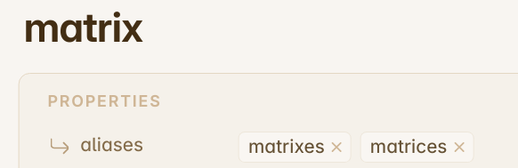
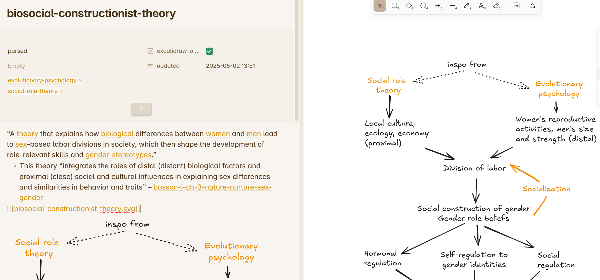
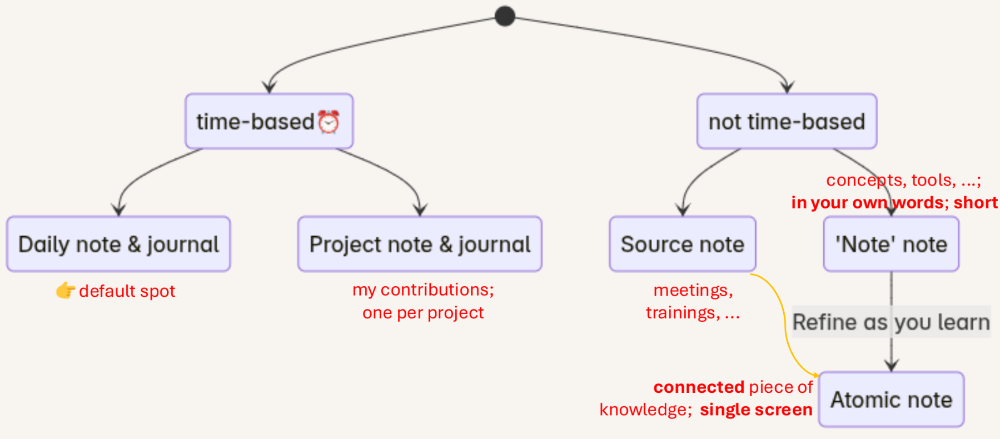
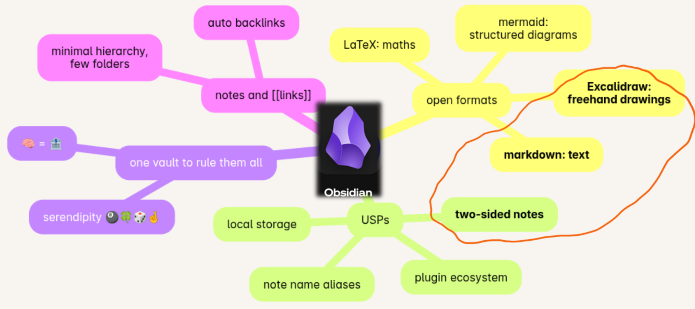

# Obsidian tidbits  
{: .no_toc }  
  
<details open markdown="block">  
  <summary>  
    Contents  
  </summary>  
  {: .text-delta }  
- TOC  
{:toc}  
</details>  
  
This page describes how I currently use [Obsidian](https://obsidian.md). Hope you find something useful 🐱 The page is published using the excellent [Enveloppe plugin](https://enveloppe.github.io/) for Obsidian.  
  
>For searchability, that is, the mighty `ctrl-F`, I will keep this one page for now. Still, my ambition is to keep each topic/FAQ atomic, trying to fit each subsection on a typical screen.   
  
## Add word variants as `aliases` in the frontmatter  
You can use the note’s `aliases` property to add singular or plural forms of note titles. For example,  
  
  
A related use case is to use aliases for acronyms such as ‘CSS’ and ‘css’. Lower case tends to make notes more legible, especially if you are inundated with acronyms. Your mileage may vary 😊  
## Use two-sided notes, combining markdown and Excalidraw  
Setting up notes to combine markdown with Excalidraw makes sure each note always has its own scratch pad for diagrams and visual 🧠-storming. I find this especially useful for source notes. If this sounds interesting, have a look at Nicole van der Hoeven’s lovely video: [Visual note templates with Obsidian Excalidraw - YouTube](https://youtu.be/zmgqMZi6QL8)  
  
This setup lets you create note like this:  
  
Left pane: markdown side – right pane: Excalidraw side, also embedded left via ` as follows:  
1. Basic > Excalidraw template file or folder: “templates”  
2. Saving > Filename > .excalidraw.md or .md: set to off – makes the default ‘.md’ files  
3. Saving > Compress Excalidraw JSON in Markdown – enable this to reduce clutter in search results.  
4. Embedding Excalidraw > Auto-export Settings > Auto-export SVG: set to on  
5. Miscellaneous features > Fade out Excalidraw markup. This helps avoid visual clutter at the bottom of each note file. Each note is self-contained and easy to share as a single markdown file.  
  
Also,  
* You can convert an existing (textual) note to incorporate Excalidraw. Use the *‘Excalidraw: Convert markdown note to Excalidraw Drawing’* command  
* To switch between the two sides of the note, use the *‘Excalidraw: Toggle between Excalidraw and markdown mode’* command.  
* You can see both sides of the note by putting them side by side – use stacked tabs. You might need to save (ctrl-S) manually to have the svg image update.  
* If you want all notes to be two-sided by default, create a template including these properties in the frontmatter:  
```yaml  
---  
excalidraw-plugin: parsed  
excalidraw-open-md: true  
---  
```  
  
- On the markdown (text) side of the note, you can embed the svg version of the Excalidraw page as usual:  
```markdown  
![[notename.svg]]  
```  
- The only (minor) disadvantage I’ve found is the extra svg files in the vault.  
  
## Note types: time-based and not time-based  
  
  
  
To be elaborated.  
## In a nutshell  
  
To be elaborated.  
## What’s in a note?  
* Name – you can change it and links will update automatically  
* Frontmatter = metadata, including aliases for more   
names/variants  
* Textual content – markdown, rendered live  
* Image content – Excalidraw, rendered as SVG  
* Inline links to other notes  
  
Backlinks and the local graph are automatically generated for you. They are a great way of discovering connections. Mention Ted Nelson’s Xanadu vision for the web.  
## You can navigate your notes in many ways  
* Find or create a note option (ctrl-O)  
* Good ol' find (ctrl-F)  
* Via outgoing links from a note  
* Linked mentions – at the bottom of each note  
* Unlinked mentions  
* Via the Files explorer – I use this mostly for organizing  
  
On a related topic, there are good plugins for spaced repetition  
## KISS: 😽  
  
  
| Less …                     | is more                                    |  
| -------------------------- | ------------------------------------------ |  
| folders                    | 🔗 links                                   |  
| vaults, docs, notebooks    | 🔗 links, again 😆                         |  
| organizing ahead of time   | 🎨 emergent themes via links 😊            |  
| word count per ‘note’ note | 🤔 reusability – linking trains of thought |  
| cloud                      | ⏳ future proofing                          |  
  
## Vault gardening – ways of learning and (re)discovering  
* Find orphaned files and broken links plugin  
* Improved random note plugin – re-visit stuff you might have forgotten  
* Use the local graph with neighbour links enabled (Filters)  
* Good ol’ search is always available  
* Try the Global graph view – your mileage may vary  
  
## Single-page presentations using Excalidraw  
To be elaborated.  
  
For details, see Zsolt Viczian’s [A detailed walkthrough of the Excalidraw-Obsidian Slideshow 3.0 script - YouTube](https://www.youtube.com/watch?v=JwgtCrIVeEU)  
  
## My favourite community plugins for Obsidian  
* Auto Link Title  
* Calendar  
* Completr – word completion  
* Emoji toolbar 🦄  
* Excalidraw   
* Find orphaned files and broken links  
* Front matter time stamps  
* Improved random note  
* Paste image rename  
* Smart typography  
* Unicode search ☂️ꭅ  
* Virtual linker / glossary  
  
These add small, nifty features. Excalidraw is the big exception  
  
## Learn more – my favourite teachers  
* Morganeua:[ Make Your Notes Last A Practical Guide for Students](https://youtu.be/eId19ggnE4E)  
	* This approach is as good for projects as well as university courses  
* Same: [Take RANDOMIZED zettelkasten notes with me!](https://youtu.be/bmolnULA3KY)  
	* Vault gardening in a fun way, embracing serendipity  
* Elizabeth Filips: [You’re Not Stupid: How to Easily Learn Difficult Things](https://youtu.be/Kz_brQBl8xk)  
* Justin Sung: [Private Lecture: How to Remember EVERYTHING You Read - YouTube](https://youtu.be/D95rCKo8vac)   
* Ahrens: How to take smart notes book – for some backstory  
